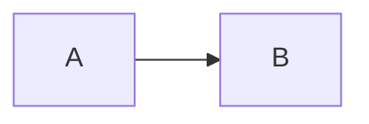
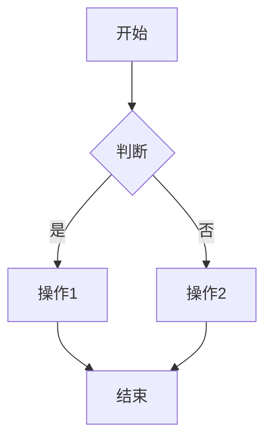
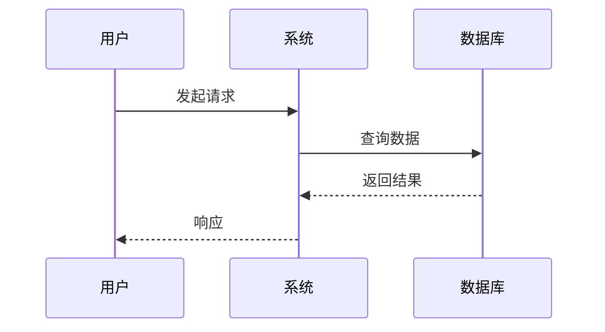
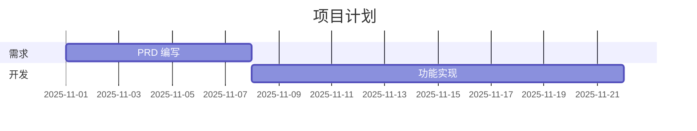

# 贡献指南

感谢你对 AI-Next 项目的关注！我们欢迎任何形式的贡献。

---

## 📋 目录

- [行为准则](#行为准则)
- [如何贡献](#如何贡献)
- [开发流程](#开发流程)
- [提交规范](#提交规范)
- [文档规范](#文档规范)
- [模板开发](#模板开发)
- [示例项目](#示例项目)

---

## 🤝 行为准则

### 我们的承诺

为了营造一个开放和友好的环境，我们承诺：

- ✅ 尊重不同的观点和经验
- ✅ 接受建设性的批评
- ✅ 关注对社区最有利的事情
- ✅ 对其他社区成员表示同理心

### 不可接受的行为

- ❌ 使用性化的语言或图像
- ❌ 人身攻击或侮辱性评论
- ❌ 公开或私下的骚扰
- ❌ 未经许可发布他人的私人信息

---

## 🚀 如何贡献

### 1. 报告 Bug

发现 Bug？请创建 Issue 并包含：

```markdown
**描述**
清晰简洁地描述问题

**复现步骤**
1. 执行 '...'
2. 查看 '...'
3. 滚动到 '...'
4. 看到错误

**预期行为**
应该发生什么

**实际行为**
实际发生了什么

**截图**
如有必要，添加截图

**环境**
- OS: [e.g. macOS 14.0]
- Node: [e.g. 18.17.0]
- Python: [e.g. 3.11]
```

### 2. 提出功能建议

有好想法？创建 Issue 并说明：

```markdown
**功能描述**
简洁描述你希望添加的功能

**动机**
为什么需要这个功能？解决什么问题？

**可选方案**
是否考虑过其他替代方案？

**附加信息**
其他任何有助于理解的信息
```

### 3. 提交代码

#### 第一步：Fork 项目

```bash
# 1. Fork 项目到你的 GitHub 账号
# 2. Clone 到本地
git clone https://github.com/your-username/ai-next.git
cd ai-next

# 3. 添加上游仓库
git remote add upstream https://github.com/original/ai-next.git
```

#### 第二步：创建分支

```bash
# 从 main 分支创建特性分支
git checkout -b feature/your-feature-name

# 或修复 Bug
git checkout -b fix/your-bug-fix
```

#### 第三步：进行修改

```bash
# 1. 进行代码或文档修改
# 2. 确保遵循项目规范
# 3. 添加必要的测试（如适用）
```

#### 第四步：提交改动

```bash
# 添加文件
git add .

# 提交（遵循 Conventional Commits）
git commit -m "feat(templates): 添加新模板 XXX"

# 推送到你的 Fork
git push origin feature/your-feature-name
```

#### 第五步：创建 Pull Request

1. 访问你的 Fork 页面
2. 点击 "New Pull Request"
3. 填写 PR 描述
4. 等待审查

---

## 🔄 开发流程

### 分支策略

```
main (主分支)
  ├── feature/xxx (功能分支)
  ├── fix/xxx (修复分支)
  └── docs/xxx (文档分支)
```

### 开发步骤

#### 1. 同步上游代码

```bash
# 获取上游更新
git fetch upstream

# 合并到本地 main
git checkout main
git merge upstream/main

# 推送到你的 Fork
git push origin main
```

#### 2. 在特性分支开发

```bash
# 创建并切换到特性分支
git checkout -b feature/new-template

# 进行开发...
# 定期提交
git add .
git commit -m "feat: 添加部分功能"

# 保持与 main 同步
git checkout main
git pull upstream main
git checkout feature/new-template
git rebase main
```

#### 3. 提交 Pull Request

```bash
# 推送到你的 Fork
git push origin feature/new-template

# 在 GitHub 创建 PR
```

---

## 📝 提交规范

### Conventional Commits

我们使用 [Conventional Commits](https://www.conventionalcommits.org/) 规范。

#### 格式

```
<type>(<scope>): <subject>

[optional body]

[optional footer]
```

#### Type 类型

| Type | 说明 | 示例 |
|------|------|------|
| `feat` | 新功能 | `feat(templates): 添加 CI/CD 模板` |
| `fix` | Bug 修复 | `fix(api-doc): 修复示例代码错误` |
| `docs` | 文档更新 | `docs(readme): 更新快速开始指南` |
| `style` | 代码格式 | `style: 格式化 Markdown 文件` |
| `refactor` | 重构 | `refactor(templates): 重组模板结构` |
| `perf` | 性能优化 | `perf: 优化 Mermaid 图表渲染` |
| `test` | 测试 | `test: 添加 BDD 场景测试` |
| `chore` | 构建/工具 | `chore: 更新 .gitignore` |
| `ci` | CI/CD | `ci: 添加 GitHub Actions` |

#### Scope 范围

常用的 scope：

- `templates` - 模板库
- `prd` - PRD 模板
- `ui-design` - UI 设计模板
- `tech-design` - 技术设计模板
- `api-doc` - API 文档模板
- `bdd` - BDD 模板
- `todolist` - TodoList 示例项目
- `docs` - 项目文档

#### 示例

```bash
# 简单提交
feat: 添加用户认证模板

# 带 scope
feat(templates): 添加 ADR (架构决策记录) 模板

# 带 body
feat(ui-design): 添加暗色模式设计规范

为 UI-design 模板添加暗色模式的颜色系统、组件适配规则和切换交互设计。

# Breaking change
feat(templates)!: 重构模板文件结构

BREAKING CHANGE: 模板文件从单文件改为目录结构，包含 template.md, CHANGELOG.md, README.md
```

---

## 📄 文档规范

### Markdown 规范

#### 1. 标题层级

```markdown
# 一级标题 (H1) - 仅用于文档标题
## 二级标题 (H2) - 章节
### 三级标题 (H3) - 小节
#### 四级标题 (H4) - 子小节
```

#### 2. 代码块

使用语言标识：

````markdown
```bash
git commit -m "feat: 添加新功能"
```

```python
def hello():
    print("Hello, World!")
```


````

#### 3. 链接

```markdown
# 相对链接（推荐）
[PRD 模板](./templates/PRD/PRD-template.md)

# 绝对链接（外部资源）
[Conventional Commits](https://www.conventionalcommits.org/)
```

#### 4. 表格

```markdown
| 列1 | 列2 | 列3 |
|-----|-----|-----|
| 值1 | 值2 | 值3 |
```

#### 5. 引用

```markdown
> 这是一段引用
> 可以跨多行
```

### Mermaid 图表

#### 流程图



#### 时序图



#### 甘特图



---

## 🎨 模板开发

### 创建新模板

#### 1. 目录结构

```
templates/
└── New-template/
    ├── New-template-template.md   # 模板主文件
    ├── CHANGELOG.md               # 版本历史
    └── README.md                  # 使用说明
```

#### 2. 模板文件内容

```markdown
# [项目名称] 新模板名称

> **模板版本**: v1.0.0 | **最后更新**: YYYY-MM-DD

---

## 1. 文档信息

| 项目 | 内容 |
|------|------|
| **项目名称** | [项目名称] |
| **文档版本** | v1.0 |
| **创建日期** | YYYY-MM-DD |
| **负责人** | [负责人] |

### 文档修订记录

| 版本 | 日期 | 修订人 | 修订内容 |
|------|------|--------|----------|
| v0.1 | YYYY-MM-DD | [姓名] | 初稿 |

---

## 2. 核心内容

[模板的主要内容]

---

## 3. 附录

[附加信息]
```

#### 3. CHANGELOG.md

```markdown
# 新模板 - 变更日志

## [1.0.0] - YYYY-MM-DD

### 新增
- 初始版本发布
- 核心章节结构

### 特性
- 支持 Mermaid 图表
- 提供示例内容
```

#### 4. README.md

```markdown
# 新模板使用指南

> **版本**: v1.0.0 | **最后更新**: YYYY-MM-DD

## 模板简介

[简要说明模板的用途和适用场景]

## 使用方法

[详细的使用步骤]

## 示例

[提供真实可用的示例]

## 最佳实践

[分享使用技巧和注意事项]
```

#### 5. 更新 templates/README.md

在模板列表中添加新模板：

```markdown
#### X. New-template - 新模板名称
**用途**: [模板用途]
**负责人**: [角色]
**模板位置**: `templates/New-template/`

**包含内容**:
- [内容1]
- [内容2]
```

---

## 📦 示例项目

### 创建新示例项目

#### 1. 项目结构

```
projects/
└── your-project/
    ├── backend/          # 后端代码
    ├── frontend/         # 前端代码
    ├── docs/             # 完整文档
    │   ├── PRD/
    │   ├── UI-design/
    │   ├── Tech-design/
    │   ├── API-doc/
    │   ├── BDD/
    │   ├── Test-plan/
    │   └── README.md
    ├── scripts/          # 脚本
    └── README.md
```

#### 2. 文档完整性

确保包含：

- ✅ PRD - 产品需求文档
- ✅ UI-design - UI/交互设计规范
- ✅ Tech-design - 技术设计文档
- ✅ API-doc - API 接口文档
- ✅ BDD - 行为驱动开发
- ✅ Project-plan - 项目执行计划（可选）
- ✅ Test-plan - 测试计划
- ✅ Release-notes - 发布说明

#### 3. README.md

```markdown
# [项目名称]

> 简要描述项目

## 项目简介

[详细描述]

## 技术栈

- 后端: [技术栈]
- 前端: [技术栈]
- 数据库: [数据库]

## 快速开始

[运行指南]

## 文档

查看 [docs/README.md](./docs/README.md)
```

---

## ✅ Pull Request 检查清单

提交 PR 前，请确认：

### 代码质量

- [ ] 代码遵循项目规范
- [ ] 所有测试通过
- [ ] 没有编译警告或错误
- [ ] 代码已自我审查

### 文档

- [ ] 更新了相关文档
- [ ] 添加了必要的注释
- [ ] 更新了 CHANGELOG.md
- [ ] README.md 保持最新

### 提交

- [ ] 提交信息符合 Conventional Commits
- [ ] 提交内容原子化（一个提交解决一个问题）
- [ ] 分支与 main 保持同步

### PR 描述

- [ ] 清晰描述了变更内容
- [ ] 引用了相关 Issue
- [ ] 添加了必要的截图（如有 UI 变更）
- [ ] 说明了测试方法

---

## 🎓 学习资源

### 推荐阅读

- [Conventional Commits](https://www.conventionalcommits.org/zh-hans/)
- [Markdown 指南](https://www.markdownguide.org/)
- [Mermaid 文档](https://mermaid.js.org/)
- [Git 最佳实践](https://git-scm.com/book/zh/v2)

### 工具推荐

- **Markdown 编辑器**: Typora, VS Code
- **图表工具**: Mermaid Live Editor
- **Git GUI**: GitKraken, Sourcetree
- **Code Review**: GitHub Pull Requests

---

## 🤝 社区

### 沟通渠道

- **GitHub Issues**: Bug 报告和功能建议
- **GitHub Discussions**: 技术讨论和问题咨询
- **Pull Requests**: 代码审查和讨论

### 会议

- **社区例会**: 每月第一个周六（待定）
- **技术分享**: 不定期

---

## 🙏 感谢

感谢所有贡献者！

你的贡献将帮助更多团队实践 AI-Native 开发。

---

## 📞 联系方式

- **项目维护者**: Yarn B
- **Email**: yarnb@qq.com
- **GitHub**: [@yarnb](https://github.com/yarnb)

---

**记住我们的核心原则**:
- 🤖 AI First - AI 是伙伴
- 📝 Doc 先行 - 文档是起点
- ✅ 实现可验证 - 验证是标准

Happy Contributing! 🚀
