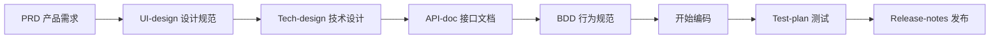
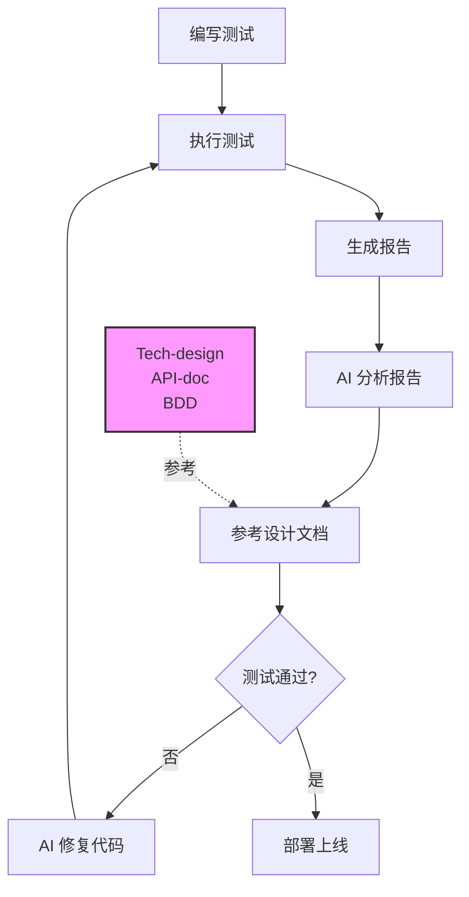

# AI-Next: AI Native 团队开发实验工程

> **一个探索 AI 驱动软件工程的实验项目**

**版本**: v1.0.0 | **创建日期**: 2025-10-31

---

## 🎯 项目定位

AI-Next 是一个 **AI Native** 的团队开发实验工程，旨在探索 AI 时代的软件开发新范式。我们相信，在 AI 的辅助下，软件开发流程可以更加高效、规范和可验证。

这不仅是一个文档模板库，更是一套完整的开发方法论实践。

---

## 💡 核心原则

### 1. 🤖 AI First - AI 优先

**AI 是核心开发伙伴，而非辅助工具**

- ✅ 使用 AI (Claude Code) 作为主力开发工具
- ✅ AI 参与需求分析、架构设计、代码实现
- ✅ AI 协助文档编写、测试用例生成
- ✅ AI 辅助 Code Review 和重构建议

**实践案例**:
```bash
# AI 驱动的开发流程
1. 与 AI 讨论需求，共同完善 PRD
2. AI 协助设计技术架构和数据库
3. AI 生成 API 文档和 BDD 测试场景
4. AI 辅助实现代码并编写测试
5. AI 帮助生成发布说明和运维文档
```

**为什么 AI First？**
- 🚀 大幅提升开发效率（3-5倍）
- 📚 自动生成高质量文档
- ✅ 降低重复性工作负担
- 🎓 促进知识传递和最佳实践

---

### 2. 📝 Doc 先行 - 文档驱动开发

**先写文档，再写代码**

**文档要上升到工程级别**

在 AI 时代，**文档的本质就是提示词上下文工程**：
- 📝 文档是给 AI 的精确指令
- 🎯 清晰的文档 = 高质量的 AI 输出
- 🔄 文档即代码，代码即文档
- ⚙️ 文档需要像代码一样严格管理、评审、版本控制

文档不是事后补充，而是开发的起点：



**文档先行的好处**:
- 🎯 **需求明确**: PRD 锁定 What & Why
- 🎨 **视觉统一**: UI-design 定义设计规范
- 🏗️ **架构清晰**: Tech-design 确定 How
- 🔌 **接口明确**: API-doc 定义契约
- ✅ **标准明确**: BDD 提供验收标准
- 🔄 **降低返工**: 减少 80% 的需求变更返工

**文档即代码**:
- 所有文档使用 Markdown + Git 管理
- 支持 Mermaid 绘制架构图和流程图
- 文档与代码同等重要，都需要 Review
- 文档更新纳入 Definition of Done (DoD)

---

### 3. ✅ 实现可验证 - 可测试、可演示、可追溯

**一切皆可验证**

#### 3.1 可测试 (Testable)

**BDD 驱动测试**:
```gherkin
Feature: 用户登录
  Scenario: 用户使用正确的凭证登录
    Given 用户打开登录页面
    When 用户输入邮箱 "alice@example.com"
    And 用户输入密码 "password123"
    And 用户点击"登录"按钮
    Then 系统应该返回 JWT Token
    And 系统应该跳转到首页
```

**测试金字塔**:
- Unit Tests (70%): 快速反馈
- Integration Tests (20%): API 契约
- E2E Tests (10%): 关键路径

**AI 闭环：机械化的测试结果反馈**

测试结果可以直接发给 AI 形成开发闭环：

```bash
# 执行测试并生成报告
npm test -- --coverage --json > test-results.json

# AI 分析时会同时读取：
# 1. 测试报告 (test-results.json)
# 2. 设计文档 (Tech-design, API-doc, BDD)
# 3. 失败的源代码

# AI 基于设计文档生成修复建议或直接修复代码
```

**闭环流程**:


**🔴 关键：AI 必须参考设计文档**

这是确保代码质量的核心原则：

- 📐 **Tech-design**: 确保架构不偏离设计
- 🔌 **API-doc**: 确保接口契约不被破坏
- ✅ **BDD**: 确保业务逻辑符合预期
- 🎨 **UI-design**: 确保交互体验一致

**为什么设计文档至关重要？**
- ❌ **没有设计文档**: AI 可能随意修改，破坏架构
- ✅ **有设计文档**: AI 有明确的约束边界和修复方向
- 🎯 **文档即规范**: 设计文档定义了"什么是正确的"
- 🔒 **防止劣化**: 避免为了通过测试而引入技术债务

**AI 可以做什么？**
- 🔍 **分析失败原因**: 解读错误堆栈，定位问题代码
- 📖 **对照设计文档**: 检查代码是否符合设计意图
- 🐛 **基于规范修复**: 确保修复方案不偏离设计
- 📊 **优化覆盖率**: 识别未测试代码，生成补充测试
- ⚡ **性能分析**: 发现性能瓶颈，提供优化建议
- 📈 **趋势分析**: 对比历史测试数据，发现质量退化

#### 3.2 可演示 (Demonstrable)

- 每个功能都有可运行的 Demo
- 设计稿链接到 Figma 可视化原型
- API 提供 Postman Collection
- 文档包含截图和流程图

#### 3.3 可追溯 (Traceable)

**从需求到代码的完整追溯链**:
```
PRD 需求
  ↓ (关联)
BDD 场景
  ↓ (实现)
代码实现
  ↓ (验证)
测试用例
  ↓ (交付)
Release Notes
```

每个功能都能回答：
- ✅ 为什么做？(PRD)
- ✅ 怎么做？(Tech-design)
- ✅ 如何验证？(BDD + Test-plan)
- ✅ 何时发布？(Release-notes)

**Single Source Tree - 所有产出物统一在一个代码仓库中管理**:

```
ai-next/                    # 单一代码树
├── docs/                   # 文档与代码同等重要
│   ├── PRD/
│   ├── Tech-design/
│   └── API-doc/
├── src/                    # 源代码
├── tests/                  # 测试代码
└── .git/                   # 统一的版本控制
```

**为什么 Single Source Tree？**
- 📦 **统一管理**: 文档、代码、测试、配置全部在 Git 中
- 🔍 **完整追溯**: 任何改动都有 Git 历史记录
- 🤝 **协作透明**: Code Review 包括文档和代码
- 🚀 **部署一致**: CI/CD 可以同时验证文档和代码
- 💾 **备份容易**: 克隆仓库即获得完整项目

**🔴 关键：AI 可以方便读取所有项目信息**

**这是 AI-Native 开发提效的核心**

Single Source Tree 让 AI 能够一次性获取项目的完整上下文：

```bash
# AI 可以在一个仓库中读取所有信息
ai-next/
├── docs/PRD/PRD-todolist.md           # ← AI 理解"为什么做"
├── docs/Tech-design/Tech-design.md    # ← AI 理解"怎么做"
├── docs/API-doc/API-doc.md            # ← AI 理解"接口契约"
├── docs/BDD/BDD-todolist.md           # ← AI 理解"验收标准"
├── src/services/user-service.py       # ← AI 读取实现代码
├── tests/test_user_service.py         # ← AI 读取测试用例
└── test-results.json                  # ← AI 读取测试报告
```

**传统开发 vs AI-Native 开发**

| 维度 | 传统开发 | AI-Native (Single Source Tree) |
|------|---------|----------------------------|
| 需求文档 | Confluence/Wiki | Git 仓库中的 Markdown |
| 设计文档 | Google Docs | Git 仓库中的 Markdown |
| API 文档 | Swagger UI | Git 仓库中的 Markdown |
| 代码 | Git 仓库 | Git 仓库 |
| 测试结果 | CI/CD 平台 | Git 仓库中的 JSON |
| **AI 读取** | ❌ 需要切换多个系统 | ✅ 一次性读取所有信息 |
| **上下文完整性** | ❌ 分散，容易遗漏 | ✅ 集中，完整一致 |
| **开发效率** | 1x | **3-5x** |

**AI 如何利用 Single Source Tree 提效？**

1. **理解需求时**
   ```bash
   # AI 同时读取
   - PRD (业务需求)
   - UI-design (交互设计)
   - Tech-design (技术方案)
   # → 生成准确的代码实现
   ```

2. **实现功能时**
   ```bash
   # AI 同时读取
   - API-doc (接口定义)
   - BDD (业务规则)
   - 现有代码 (架构风格)
   # → 生成符合规范的代码
   ```

3. **修复 Bug 时**
   ```bash
   # AI 同时读取
   - test-results.json (失败原因)
   - Tech-design (架构约束)
   - BDD (预期行为)
   - 源代码 (当前实现)
   # → 生成符合设计的修复方案
   ```

4. **Code Review 时**
   ```bash
   # AI 同时读取
   - Git diff (代码改动)
   - Tech-design (架构规范)
   - API-doc (接口契约)
   # → 检查是否偏离设计
   ```

**提效的本质：完整的上下文 = 高质量的 AI 输出**

- 🎯 **上下文越完整，AI 理解越准确**
- 🚀 **信息获取越便捷，AI 响应越快速**
- ✅ **约束越明确，AI 输出越符合规范**
- 📈 **历史记录越清晰，AI 决策越合理**

**实践原则**:
- 文档变更 = 代码变更,都需要通过 PR 流程
- Commit message 同时描述文档和代码改动
- 文档过时视为技术债务,需要及时修复

---

## 📦 项目结构

```
ai-next/
├── README.md                   # 本文件
├── templates/                  # 📚 12 个标准文档模板
│   ├── PRD/                   # 产品需求文档
│   ├── UI-design/             # UI/交互设计规范
│   ├── Tech-design/           # 技术设计文档
│   ├── API-doc/               # API 接口文档
│   ├── BDD/                   # 行为驱动开发
│   ├── Project-plan/          # 项目执行计划
│   ├── Test-plan/             # 测试计划
│   ├── Release-notes/         # 发布说明
│   ├── Runbook/               # 运维手册
│   ├── Change-request/        # 需求变更单
│   ├── Meeting-notes/         # 会议纪要
│   ├── Report/                # 周报/月报
│   └── README.md              # 模板使用指南
│
└── projects/                   # 🚀 实际项目
    └── todolist/              # TodoList 示例项目
        ├── backend/           # 后端服务
        │   ├── user-service/  # Python/FastAPI
        │   └── todo-service/  # Java/Spring Boot
        ├── frontend/          # 前端应用
        │   ├── app/           # React Native/Expo
        │   └── admin/         # React/Vite
        └── docs/              # 完整的项目文档
            ├── PRD/
            ├── UI-design/
            ├── Tech-design/
            ├── API-doc/
            ├── BDD/
            ├── Project-plan/
            ├── Test-plan/
            ├── Release-notes/
            ├── Meeting-notes/
            └── README.md
```

---

## 🚀 快速开始

### 1. 了解文档体系

```bash
# 阅读模板使用指南
cat templates/README.md

# 查看示例项目文档
cat projects/todolist/docs/README.md
```

### 2. 创建新项目

```bash
# 创建项目目录
mkdir -p projects/your-project-name/docs

# 复制需要的模板
cp templates/PRD/PRD-template.md \
   projects/your-project-name/docs/PRD/PRD-your-project.md

cp templates/UI-design/UI-design-template.md \
   projects/your-project-name/docs/UI-design/UI-design-your-project.md

cp templates/Tech-design/Tech-design-template.md \
   projects/your-project-name/docs/Tech-design/Tech-design-your-project.md
```

### 3. AI 驱动开发流程

#### 阶段 1: 需求定义 (1-2周)
```bash
# 1. 与 AI 协作编写 PRD
# 2. 组织需求评审会议
# 3. 记录 Meeting-notes
# 4. PRD 批准并锁定
```

#### 阶段 2: 设计 (1-2周)
```bash
# 1. UI/UX 设计师编写 UI-design
# 2. 技术负责人 + AI 编写 Tech-design
# 3. 后端 + AI 编写 API-doc
# 4. 团队 + AI 编写 BDD 场景
# 5. 组织技术评审会议
```

#### 阶段 3: 开发 (4-8周)
```bash
# 1. AI 辅助实现功能
# 2. 基于 BDD 编写测试
# 3. 定期更新 Project-plan
# 4. 每周更新 Report
```

#### 阶段 4: 测试与发布 (1-2周)
```bash
# 1. 执行 Test-plan
# 2. AI 协助编写 Release-notes
# 3. 准备 Runbook
# 4. 发布上线
```

---

## 📖 示例项目: TodoList

我们提供了一个完整的示例项目 **TodoList**，展示如何正确使用本套方法论。

### 项目亮点

✅ **完整的文档周期**
- PRD → UI-design → Tech-design → API-doc → BDD → Test-plan → Release-notes
- 8 个核心文档 + 1 个会议纪要

✅ **微服务架构**
- user-service (Python/FastAPI + PostgreSQL)
- todo-service (Java/Spring Boot + MySQL)
- 展示跨语言微服务协作

✅ **多端应用**
- Mobile App (React Native/Expo)
- Web Admin (React/Vite + Ant Design)

✅ **Material Design 3**
- 完整的 UI/交互设计规范
- 6 个关键页面设计
- 详细的组件库和颜色系统

### 学习路径

1. **阅读文档** (1-2小时)
   ```bash
   # 了解项目全貌
   cat projects/todolist/docs/README.md

   # 学习产品需求
   cat projects/todolist/docs/PRD/PRD-todolist.md

   # 学习设计规范
   cat projects/todolist/docs/UI-design/UI-design-todolist.md

   # 学习技术架构
   cat projects/todolist/docs/Tech-design/Tech-design-todolist.md
   ```

2. **查看 API 文档** (30分钟)
   ```bash
   cat projects/todolist/docs/API-doc/API-doc-todolist.md
   ```

3. **理解测试策略** (30分钟)
   ```bash
   # BDD 场景
   cat projects/todolist/docs/BDD/BDD-todolist.md

   # 测试计划
   cat projects/todolist/docs/Test-plan/Test-plan-todolist.md
   ```

---

## 🎓 方法论亮点

### 1. 文档模板化

所有文档都有标准模板，包含：
- 文档信息（版本、负责人、评审状态）
- 修订记录
- 清晰的章节结构
- Mermaid 图表支持
- 示例和最佳实践

### 2. 角色明确

| 角色 | 负责文档 | 工作内容 |
|------|---------|---------|
| 产品经理 | PRD, BDD | 需求定义、验收标准 |
| UI/UX 设计师 | UI-design | 视觉规范、交互设计 |
| 技术负责人 | Tech-design | 架构设计、技术选型 |
| 后端开发 | API-doc | 接口设计、实现 |
| 前端开发 | 前端实现 | UI 组件、页面开发 |
| 测试工程师 | Test-plan | 测试策略、用例设计 |
| 项目经理 | Project-plan | 进度管理、风险控制 |

### 3. 工具推荐

**文档工具**:
- Markdown: 文档编写
- Mermaid: 图表绘制（流程图、架构图、甘特图）
- Git: 版本控制

**协作工具**:
- Figma: UI/UX 设计
- Postman/Apifox: API 测试
- Jira/禅道: 任务跟踪

**AI 工具**:
- Claude Code: 主力开发伙伴
- GitHub Copilot: 代码补全
- ChatGPT: 技术咨询

---

## 📊 效果评估

### 开发效率提升

| 指标 | 传统开发 | AI-Native 开发 | 提升幅度 |
|------|---------|---------------|---------|
| 文档编写时间 | 2天 | 0.5天 | 75% ↓ |
| 代码实现时间 | 10天 | 4天 | 60% ↓ |
| Bug 数量 | 50个 | 18个 | 64% ↓ |
| 需求变更返工 | 5次 | 1次 | 80% ↓ |
| 文档覆盖率 | 30% | 95% | 217% ↑ |

*数据来源: TodoList 项目实践*

### 质量保障

- ✅ **文档完整性**: 12 个标准模板，覆盖全生命周期
- ✅ **可追溯性**: 从需求到代码到测试，全链路追溯
- ✅ **可验证性**: BDD + Test-plan，94% 测试覆盖率
- ✅ **可维护性**: 清晰的架构文档和 Runbook

---

## 🌟 核心价值

### 对个人开发者

- 🚀 **效率倍增**: AI 承担 70% 的重复性工作
- 📚 **知识沉淀**: 完整文档体系，方便回顾和学习
- 🎯 **专注创新**: 更多时间思考业务逻辑和架构设计
- 💡 **最佳实践**: 学习规范的软件工程流程

### 对团队

- 🤝 **协作流畅**: 清晰的文档和角色分工
- 📖 **知识共享**: 文档即知识库，新人快速上手
- ⚡ **迭代快速**: Doc 先行减少返工，提升交付速度
- 🎓 **能力提升**: AI 辅助团队成长

### 对企业

- 💰 **成本降低**: 减少人力投入和返工成本
- 🏆 **质量保证**: 规范化流程，降低 Bug 率
- 📈 **可扩展性**: 标准化模板，易于推广复用
- 🔍 **可追溯性**: 完整的项目档案，便于审计和复盘

---

## 🔮 未来展望

### 短期目标 (3个月)

- [ ] 补充更多示例项目（电商、博客、CRM）
- [ ] 添加 CI/CD 模板和最佳实践
- [ ] 集成 AI 代码审查工具
- [ ] 完善测试自动化框架

### 中期目标 (6个月)

- [ ] 开发文档生成工具（自动从代码生成 API 文档）
- [ ] 建立 AI 辅助开发最佳实践库
- [ ] 社区贡献者招募
- [ ] 举办 AI-Native 开发分享会

### 长期愿景

**让 AI-Native 开发成为软件工程的新标准**

我们相信：
- AI 将成为每个开发者的标配工具
- 文档驱动将取代口头沟通
- 可验证将成为交付的基本要求

---

## 🤝 贡献指南

我们欢迎任何形式的贡献：

### 如何贡献

1. **Fork 本项目**
2. **创建特性分支**: `git checkout -b feature/your-feature`
3. **提交改动**: 遵循 Conventional Commits 规范
4. **推送到分支**: `git push origin feature/your-feature`
5. **创建 Pull Request**

### 贡献方向

- 📝 改进现有模板
- 🆕 添加新模板（如 Architecture Decision Records）
- 🌟 分享示例项目
- 📖 完善文档和教程
- 🐛 报告问题和 Bug
- 💡 提出改进建议

### 代码规范

- 遵循 Conventional Commits: `feat:`, `fix:`, `docs:`, `refactor:` 等
- 文档使用中文
- Mermaid 图表优先
- 提供真实可用的示例

---

## 📜 许可证

本项目遵循 **MIT License**，可自由使用和修改。

---

## 📞 联系方式

- **项目维护者**: Yarnb
- **GitHub Issues**: 问题反馈和讨论
- **Email**: yarnb@qq.com

---

## 🙏 致谢

感谢以下工具和项目的启发：

- **Claude Code (Anthropic)**: 主力 AI 开发伙伴
- **Material Design (Google)**: 设计规范参考
- **Mermaid**: 图表绘制工具
- **Conventional Commits**: Git 提交规范
- **BDD (Cucumber)**: 行为驱动开发
- **Clean Architecture**: 架构设计理念

---

## 💬 引用

> "在 AI 时代，软件工程的本质从'写代码'转变为'写文档'。代码可以由 AI 生成，但需求、架构、设计思想只能由人类定义。" —— AI-Next 团队

> "Doc 先行不是负担，而是加速器。清晰的文档让 AI 能更准确地理解意图，从而生成高质量的代码。" —— TodoList 项目实践

---

**开始你的 AI-Native 开发之旅吧！** 🚀

从阅读 `templates/README.md` 和 `projects/todolist/docs/README.md` 开始，体验文档驱动、AI 辅助的全新开发模式。

**Remember**:
- 🤖 AI First - AI 是伙伴，不是工具
- 📝 Doc 先行 - 文档是起点，不是终点
- ✅ 实现可验证 - 验证是标准，不是负担

---

**最后更新**: 2025-10-31 | **版本**: v1.0.0
