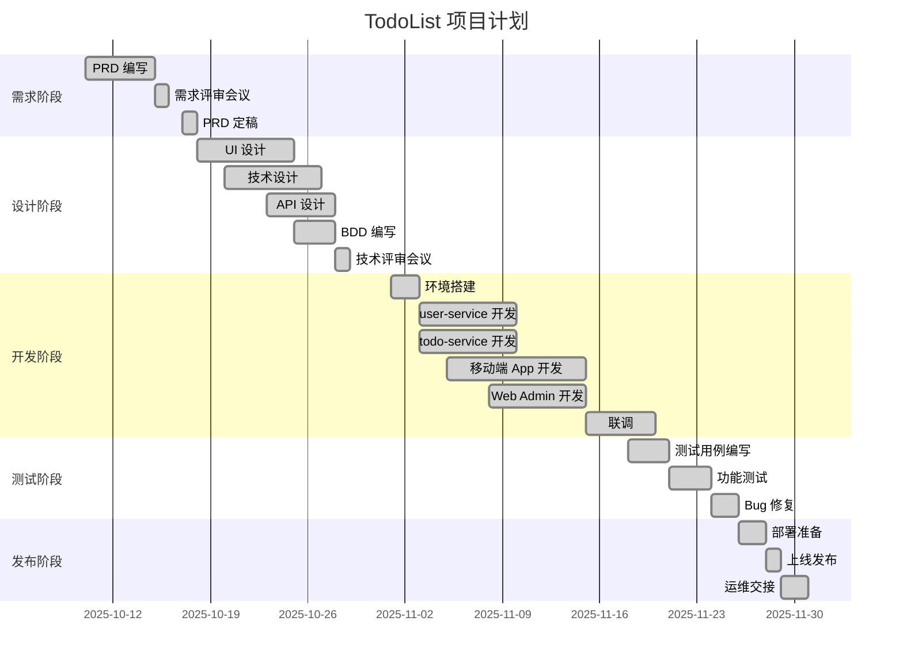

# TodoList 项目执行计划

> **模板版本**: v1.0.0（基于 templates/Project-plan）

## 1. 文档信息

| 项目 | 内容 |
|------|------|
| **项目名称** | TodoList |
| **文档版本** | v1.0 |
| **创建日期** | 2025-10-29 |
| **项目经理** | Bob (Tech Lead兼任) |
| **项目周期** | 2025-11-01 ~ 2025-11-30 (4周) |
| **项目状态** | ✅ 已完成 |

---

## 2. 项目概述

**项目目标**: 开发一个基于微服务架构的待办事项管理系统，展示多语言微服务协作和前后端分离架构。

**关键里程碑**:
- ✅ 需求评审通过 (2025-10-15)
- ✅ 技术设计完成 (2025-10-28)
- ✅ 开发完成 (2025-11-20)
- ✅ 测试完成 (2025-11-25)
- ✅ 上线发布 (2025-11-30)

---

## 3. 团队组成

| 角色 | 姓名 | 职责 | 投入度 |
|------|------|------|--------|
| 产品经理 | Alice | PRD、BDD | 50% |
| 技术负责人 | Bob | 技术设计、架构 | 100% |
| 后端开发 | Eva | user-service、todo-service | 100% |
| 前端开发 | David | App + Admin | 100% |
| 测试工程师 | Frank | 测试计划、执行 | 80% |
| UI 设计师 | Grace | UI 设计 | 30% |

---

## 4. 项目计划 (Gantt)

---

## 5. 任务分解 (WBS)

### 5.1 后端开发

| 任务 | 负责人 | 预计工时 | 实际工时 | 状态 |
|------|--------|---------|----------|------|
| user-service 基础框架 | Eva | 8h | 6h | ✅ 完成 |
| 用户认证功能 | Eva | 16h | 18h | ✅ 完成 |
| Token 验证接口 | Eva | 8h | 8h | ✅ 完成 |
| todo-service 基础框架 | Eva | 8h | 7h | ✅ 完成 |
| 任务 CRUD 功能 | Eva | 20h | 22h | ✅ 完成 |
| 服务间通信实现 | Eva | 12h | 14h | ✅ 完成 |
| Docker 配置 | Eva | 4h | 5h | ✅ 完成 |

### 5.2 前端开发

| 任务 | 负责人 | 预计工时 | 实际工时 | 状态 |
|------|--------|---------|----------|------|
| App 项目搭建 | David | 4h | 4h | ✅ 完成 |
| 登录注册页面 | David | 12h | 14h | ✅ 完成 |
| 任务列表页面 | David | 16h | 18h | ✅ 完成 |
| API 封装 | David | 8h | 6h | ✅ 完成 |
| Admin 项目搭建 | David | 4h | 4h | ✅ 完成 |
| Admin 各页面开发 | David | 20h | 22h | ✅ 完成 |

---

## 6. 风险管理

| 风险 | 等级 | 发生概率 | 影响 | 应对措施 | 责任人 | 状态 |
|------|------|----------|------|----------|--------|------|
| 微服务通信不稳定 | 中 | 30% | 功能不可用 | 添加重试和超时机制 | Eva | ✅ 已缓解 |
| 前端工作量超预期 | 高 | 60% | 延期 | Admin 功能简化 | Bob | ✅ 已缓解 |
| Token 安全问题 | 高 | 20% | 安全风险 | 短有效期+HTTPS | Eva | ✅ 已缓解 |

---

## 7. 项目复盘

### 7.1 做得好的地方

✅ **文档先行**: PRD、Tech-design、API-doc 齐全，团队沟通顺畅
✅ **技术选型合理**: 微服务架构展示效果好
✅ **进度控制**: 虽有延期，但在可控范围内

### 7.2 需要改进

⚠️ **工时估算**: 前端工作量低估了约20%
⚠️ **测试介入时机**: 应该在开发阶段就开始编写测试用例
⚠️ **Code Review**: 代码审查不够及时

### 7.3 经验教训

1. 微服务架构对小项目确实增加了复杂度，但收获了宝贵经验
2. 前端两个项目并行开发，工作量被低估
3. BDD 文档对测试帮助很大，值得推广

---

**项目经理**: Bob | **完成日期**: 2025-11-30
