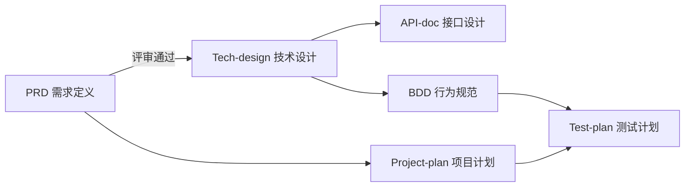

# TodoList 项目文档

这是 TodoList 项目的完整文档集合，展示了如何使用标准文档模板管理项目全生命周期。

**文档更新日期**: 2025-10-31

---

## 📁 文档目录结构

```
docs/
├── PRD/                  # 产品需求文档
│   └── PRD-todolist-v1.0.md
├── Tech-design/          # 技术设计文档
├── API-doc/              # API 接口文档
├── BDD/                  # 行为驱动开发文档
├── Project-plan/         # 项目执行计划
├── Test-plan/            # 测试计划
├── Release-notes/        # 发布说明
└── README.md             # 本文件
```

---

## 📚 文档导航

### 核心文档

#### 1. [PRD - 产品需求文档](./PRD/PRD-todolist-v1.0.md) ✅
**状态**: 已批准 | **负责人**: Alice (Product Manager) | **版本**: v1.0

**包含内容**:
- 项目背景和目标
- 用户分析和使用场景
- 详细的功能需求说明
- 非功能需求
- 成功指标

**适合人群**: 所有团队成员，了解产品要做什么

---

#### 2. Tech-design - 技术设计文档 ⏳
**状态**: 待创建 | **负责人**: Bob (Tech Lead)

**计划内容**:
- 系统架构设计
- 数据库设计
- API 设计概览
- 技术选型说明

---

#### 3. API-doc - API 接口文档 ⏳
**状态**: 待创建 | **负责人**: Backend Team

**计划内容**:
- RESTful API 规范
- 接口详细说明
- 请求/响应示例
- 错误码定义

---

#### 4. BDD - 行为驱动开发文档 ⏳
**状态**: 待创建 | **负责人**: QA Team + Product

**计划内容**:
- Gherkin 格式用户场景
- 验收测试标准
- 自动化测试基础

---

#### 5. Project-plan - 项目执行计划 ⏳
**状态**: 待创建 | **负责人**: PM Team

**计划内容**:
- 项目里程碑
- 任务分解 (WBS)
- 时间计划 (Gantt)
- 风险管理

---

## 🔄 文档工作流



---

## 📖 如何使用这些文档

### 👨‍💼 产品经理
1. 阅读并维护 **PRD**
2. 参与 **BDD** 编写
3. 定期查看 **Project-plan** 进度

### 👨‍💻 开发工程师
1. 基于 **PRD** 和 **Tech-design** 开发
2. 参考 **API-doc** 进行接口对接
3. 根据 **BDD** 编写自动化测试

---

**维护者**: Bob (Tech Lead)
