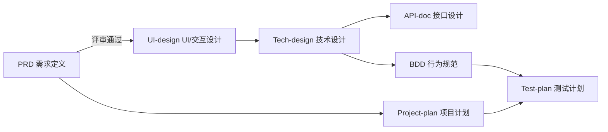

# TodoList 项目文档

这是 TodoList 项目的完整文档集合，展示了如何使用标准文档模板管理项目全生命周期。

**文档更新日期**: 2025-10-31

---

## 📁 文档目录结构

```
docs/
├── PRD/                  # 产品需求文档
│   └── PRD-todolist-v1.0.md
├── Tech-design/          # 技术设计文档
├── API-doc/              # API 接口文档
├── BDD/                  # 行为驱动开发文档
├── Project-plan/         # 项目执行计划
├── Test-plan/            # 测试计划
├── Release-notes/        # 发布说明
└── README.md             # 本文件
```

---

## 📚 文档导航

### 核心文档

#### 1. [PRD - 产品需求文档](./PRD/PRD-todolist.md) ✅
**状态**: 已批准 | **负责人**: Alice (Product Manager) | **版本**: v1.0 | **日期**: 2025-10-17

**包含内容**:
- 项目背景和目标
- 用户分析和使用场景
- 详细的功能需求说明
- 非功能需求
- 成功指标

**适合人群**: 所有团队成员，了解产品要做什么

---

#### 2. [UI-design - UI/交互设计规范](./UI-design/UI-design-todolist.md) ✅
**状态**: 已批准 | **负责人**: Grace (UI/UX Designer) | **版本**: v1.0 | **日期**: 2025-10-31

**包含内容**:
- 视觉设计规范（品牌色、字体、间距、圆角、阴影）
- 组件库设计（按钮、输入框、卡片、列表、对话框）
- 信息架构（页面结构、导航结构）
- 页面设计（登录页、任务列表、编辑任务、个人中心、Web Admin）
- 交互设计（手势操作、状态反馈、动画）
- 响应式设计和可访问性规范

**适合人群**: UI/UX 设计师、前端开发、产品经理

---

#### 3. [Tech-design - 技术设计文档](./Tech-design/Tech-design-todolist.md) ✅
**状态**: 已批准 | **负责人**: Bob (Tech Lead) | **版本**: v1.0 | **日期**: 2025-10-28

**包含内容**:
- 微服务架构设计（user-service + todo-service）
- 数据库设计（PostgreSQL + MySQL）
- 技术栈选型（Python/Java/TypeScript）
- 安全设计和性能优化
- 技术决策记录 (ADR)

---

#### 4. [API-doc - API 接口文档](./API-doc/API-doc-todolist.md) ✅
**状态**: 已批准 | **负责人**: Eva (Backend Lead) | **版本**: v1.0 | **日期**: 2025-10-27

**包含内容**:
- user-service API（认证、用户管理）
- todo-service API（任务 CRUD）
- 请求/响应示例
- 错误码说明
- SDK 示例代码

---

#### 5. [BDD - 行为驱动开发文档](./BDD/BDD-todolist.md) ✅
**状态**: 已完成 | **负责人**: Frank (QA) + Alice (PM) | **版本**: v1.0 | **日期**: 2025-10-25

**包含内容**:
- Gherkin 格式用户场景
- 用户认证场景（注册、登录）
- 任务管理场景（CRUD、筛选）
- 验收标准清单

---

#### 6. [Project-plan - 项目执行计划](./Project-plan/Project-plan-todolist.md) ✅
**状态**: 已完成 | **负责人**: Bob (Tech Lead) | **版本**: v1.0 | **日期**: 2025-11-30

**包含内容**:
- 项目团队组成
- Gantt 图（需求→设计→开发→测试→发布）
- 任务分解 (WBS)
- 风险管理
- 项目复盘

---

#### 7. [Release-notes - 发布说明](./Release-notes/Release-notes-todolist.md) ✅
**状态**: 已发布 | **负责人**: Bob (Tech Lead) | **版本**: v1.0.0 | **日期**: 2025-11-30

**包含内容**:
- V1.0.0 新功能列表
- 技术栈说明
- 部署指南
- 已知问题

---

#### 8. [Test-plan - 测试计划](./Test-plan/Test-plan-todolist.md) ✅
**状态**: 已完成 | **负责人**: Frank (QA Lead) | **版本**: v1.0.0 | **日期**: 2025-11-25

**包含内容**:
- 测试策略和类型（单元、集成、E2E、UAT）
- 详细测试用例（30+ 个）
- 缺陷统计和管理
- 测试结论：✅ 通过，建议发布

---

#### 9. [Meeting-notes - 会议纪要](./Meeting-notes/) ✅

**需求评审会议** (2025-10-15):
- [需求评审会议纪要](./Meeting-notes/Meeting-notes-需求评审会议.md)
- PRD 批准决策
- 微服务架构确认
- 功能范围界定

---

## 🔄 文档工作流



---

## 📖 如何使用这些文档

### 👨‍💼 产品经理
1. 阅读并维护 **PRD**
2. 参与 **BDD** 编写
3. 定期查看 **Project-plan** 进度

### 🎨 UI/UX 设计师
1. 基于 **PRD** 创建 **UI-design**
2. 定义视觉规范和组件库
3. 与前端开发协作交付设计资源

### 👨‍💻 开发工程师
1. 基于 **PRD**、**UI-design** 和 **Tech-design** 开发
2. 参考 **API-doc** 进行接口对接
3. 根据 **BDD** 编写自动化测试

---

**维护者**: Bob (Tech Lead)
