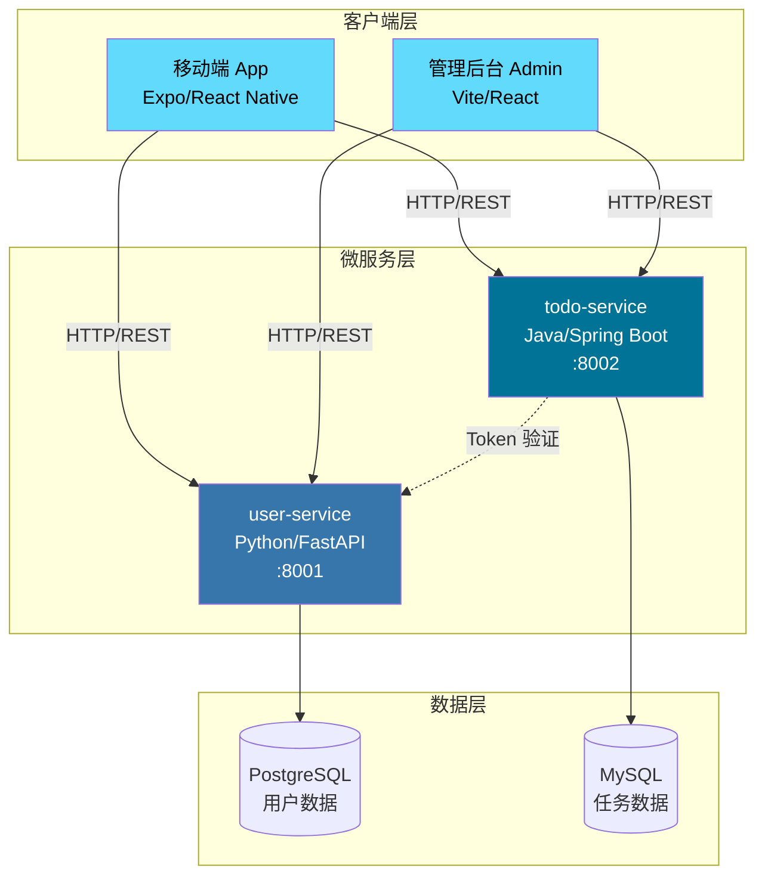
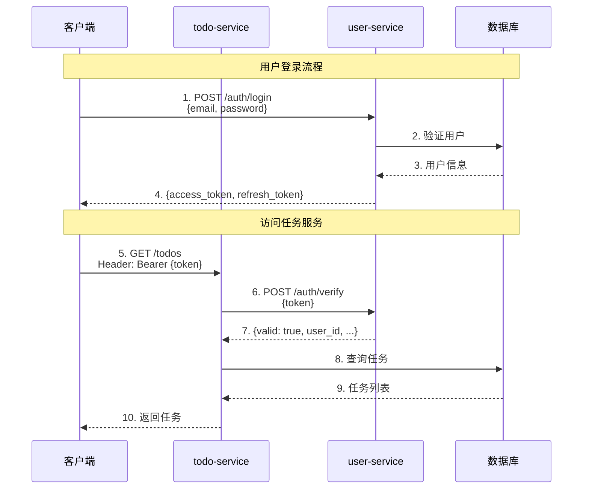
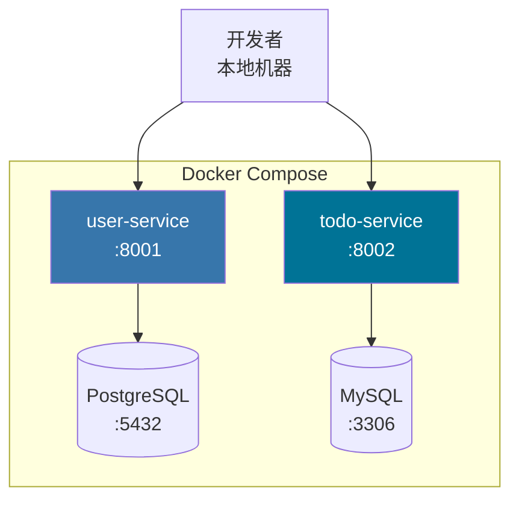

# TodoList 技术设计文档

> **模板版本**: v1.0.0（基于 templates/Tech-design）

---

## 1. 文档信息

| 项目 | 内容 |
|------|------|
| **项目名称** | TodoList - 待办事项管理系统 |
| **文档版本** | v1.0 |
| **创建日期** | 2025-10-20 |
| **最后更新** | 2025-10-25 |
| **负责人** | Bob (Tech Lead) |
| **评审状态** | ✅ 已批准（2025-10-28） |
| **关联文档** | [PRD-todolist.md](../PRD/PRD-todolist.md) |

### 文档修订记录

| 版本 | 日期 | 修订人 | 修订内容 |
|------|------|--------|----------|
| v0.1 | 2025-10-20 | Bob | 初稿，整体架构设计 |
| v0.5 | 2025-10-23 | Bob + Eva | 补充数据库设计和 API 设计 |
| v1.0 | 2025-10-25 | Bob | 技术评审后定稿 |

---

## 2. 技术概述

### 2.1 项目目标

实现一个基于微服务架构的待办事项管理系统，展示：
- 多语言微服务协作（Python + Java）
- 前后端分离架构（移动端 + Web 端）
- 服务间通信和认证机制
- 现代化的技术栈实践

### 2.2 技术原则

1. **简单优先**: 避免过度设计，V1.0 保持最小可用功能
2. **可扩展性**: 预留扩展接口，为 V2.0 团队协作功能做准备
3. **技术展示**: 采用主流技术栈，展示最佳实践
4. **文档驱动**: 完善的 API 文档和运维文档

### 2.3 非功能需求

| 指标 | 目标值 | 说明 |
|------|--------|------|
| **响应时间** | P95 < 500ms | API 响应时间 |
| **并发用户** | 100+ | 同时在线用户 |
| **可用性** | 95%+ | V1.0 目标，V2.0 提升到 99% |
| **数据持久化** | 99.9% | 不丢失用户数据 |
| **可维护性** | 清晰的代码结构和文档 | 新人 1 周内上手 |

---

## 3. 系统架构

### 3.1 整体架构



### 3.2 架构说明

**分层架构**:
1. **客户端层**: 移动端和 Web 端，通过 HTTP/REST 调用后端服务
2. **微服务层**: 按业务领域拆分的独立服务
3. **数据层**: 每个服务独立的数据库

**服务职责**:
- **user-service**: 用户认证和授权中心
  - 用户注册/登录
  - JWT Token 签发
  - Token 验证（供其他服务调用）
  - 用户信息管理

- **todo-service**: 任务管理服务
  - 任务 CRUD 操作
  - 任务状态和优先级管理
  - 调用 user-service 验证用户身份

**数据隔离**:
- 每个服务使用独立的数据库
- 服务间不直接访问对方的数据库
- 通过 API 接口进行数据交互

---

## 4. 技术栈

### 4.1 后端技术栈

#### user-service (Python/FastAPI)

| 层次 | 技术 | 版本 | 说明 |
|------|------|------|------|
| **框架** | FastAPI | 0.109.0 | 高性能异步框架 |
| **语言** | Python | 3.11+ | |
| **ORM** | SQLAlchemy | 2.0.25 | 数据库 ORM |
| **数据库** | PostgreSQL | 14+ | 关系型数据库 |
| **认证** | python-jose | 3.3.0 | JWT 实现 |
| **密码加密** | passlib | 1.7.4 | Bcrypt |
| **验证** | Pydantic | 2.5.3 | 数据验证 |
| **服务器** | Uvicorn | 0.27.0 | ASGI 服务器 |

**选择理由**:
- FastAPI 性能优秀，文档自动生成
- Python 生态丰富，快速开发
- PostgreSQL 成熟稳定

#### todo-service (Java/Spring Boot)

| 层次 | 技术 | 版本 | 说明 |
|------|------|------|------|
| **框架** | Spring Boot | 3.2.0 | 企业级框架 |
| **语言** | Java | 17 | LTS 版本 |
| **ORM** | Spring Data JPA | 3.2.0 | 数据访问 |
| **数据库** | MySQL | 8.0+ | 关系型数据库 |
| **构建工具** | Maven | 3.9+ | 依赖管理 |
| **工具库** | Lombok | 1.18+ | 简化代码 |
| **监控** | Actuator | 3.2.0 | 健康检查 |

**选择理由**:
- Spring Boot 成熟稳定，企业级标准
- Java 强类型，适合业务逻辑
- MySQL 广泛使用，运维成熟

### 4.2 前端技术栈

#### 移动端 App (Expo/React Native)

| 层次 | 技术 | 版本 | 说明 |
|------|------|------|------|
| **框架** | Expo | ~50.0.0 | 跨平台开发框架 |
| **运行时** | React Native | 0.73.0 | |
| **语言** | TypeScript | 5.3.3 | 类型安全 |
| **导航** | React Navigation | 6.1.9 | 路由管理 |
| **UI 库** | React Native Paper | 5.11.0 | Material Design |
| **HTTP** | Axios | 1.6.0 | API 调用 |

#### Web 管理后台 (Vite/React)

| 层次 | 技术 | 版本 | 说明 |
|------|------|------|------|
| **构建工具** | Vite | 5.0.8 | 快速构建 |
| **框架** | React | 18.2.0 | UI 框架 |
| **语言** | TypeScript | 5.3.3 | 类型安全 |
| **路由** | React Router | 6.21.0 | 路由管理 |
| **UI 库** | Ant Design | 5.12.0 | 企业级 UI |
| **HTTP** | Axios | 1.6.0 | API 调用 |

### 4.3 基础设施

| 类型 | 技术 | 说明 |
|------|------|------|
| **容器化** | Docker | 服务容器化 |
| **编排** | Docker Compose | 本地开发环境 |
| **版本控制** | Git | 代码管理 |
| **API 文档** | OpenAPI/Swagger | 自动生成 API 文档 |

---

## 5. 数据库设计

### 5.1 user-service 数据库 (PostgreSQL)

#### users 表

```sql
CREATE TABLE users (
    id VARCHAR(36) PRIMARY KEY DEFAULT gen_random_uuid()::text,
    email VARCHAR(255) UNIQUE NOT NULL,
    username VARCHAR(50) UNIQUE NOT NULL,
    hashed_password VARCHAR(255) NOT NULL,
    is_active BOOLEAN DEFAULT TRUE NOT NULL,
    created_at TIMESTAMP DEFAULT CURRENT_TIMESTAMP NOT NULL,
    updated_at TIMESTAMP DEFAULT CURRENT_TIMESTAMP NOT NULL
);

-- 索引
CREATE INDEX idx_users_email ON users(email);
CREATE INDEX idx_users_username ON users(username);
CREATE INDEX idx_users_active ON users(is_active) WHERE is_active = TRUE;

-- 触发器：自动更新 updated_at
CREATE TRIGGER update_users_updated_at
    BEFORE UPDATE ON users
    FOR EACH ROW
    EXECUTE FUNCTION update_updated_at_column();
```

**字段说明**:

| 字段 | 类型 | 约束 | 说明 |
|------|------|------|------|
| id | VARCHAR(36) | PRIMARY KEY | UUID 主键 |
| email | VARCHAR(255) | UNIQUE, NOT NULL | 邮箱（登录凭证） |
| username | VARCHAR(50) | UNIQUE, NOT NULL | 用户名 |
| hashed_password | VARCHAR(255) | NOT NULL | Bcrypt 加密密码 |
| is_active | BOOLEAN | DEFAULT TRUE | 账户状态 |
| created_at | TIMESTAMP | DEFAULT NOW() | 创建时间 |
| updated_at | TIMESTAMP | DEFAULT NOW() | 更新时间 |

### 5.2 todo-service 数据库 (MySQL)

#### todos 表

```sql
CREATE TABLE todos (
    id VARCHAR(36) PRIMARY KEY,
    user_id VARCHAR(36) NOT NULL,
    title VARCHAR(100) NOT NULL,
    description VARCHAR(500),
    completed BOOLEAN NOT NULL DEFAULT FALSE,
    priority ENUM('HIGH', 'MEDIUM', 'LOW') NOT NULL DEFAULT 'MEDIUM',
    due_date DATETIME,
    created_at DATETIME NOT NULL DEFAULT CURRENT_TIMESTAMP,
    updated_at DATETIME NOT NULL DEFAULT CURRENT_TIMESTAMP ON UPDATE CURRENT_TIMESTAMP,

    INDEX idx_user_id (user_id),
    INDEX idx_completed (completed),
    INDEX idx_priority (priority),
    INDEX idx_due_date (due_date),
    INDEX idx_user_completed (user_id, completed)
) ENGINE=InnoDB DEFAULT CHARSET=utf8mb4 COLLATE=utf8mb4_unicode_ci;
```

**字段说明**:

| 字段 | 类型 | 约束 | 说明 |
|------|------|------|------|
| id | VARCHAR(36) | PRIMARY KEY | UUID 主键 |
| user_id | VARCHAR(36) | NOT NULL, INDEX | 用户 ID（外键，逻辑关联） |
| title | VARCHAR(100) | NOT NULL | 任务标题 |
| description | VARCHAR(500) | NULL | 任务描述 |
| completed | BOOLEAN | DEFAULT FALSE | 完成状态 |
| priority | ENUM | DEFAULT 'MEDIUM' | 优先级（高/中/低） |
| due_date | DATETIME | NULL | 截止日期 |
| created_at | DATETIME | DEFAULT NOW() | 创建时间 |
| updated_at | DATETIME | AUTO UPDATE | 更新时间 |

**索引策略**:
- `idx_user_id`: 按用户查询任务
- `idx_completed`: 按完成状态筛选
- `idx_priority`: 按优先级排序
- `idx_due_date`: 查询即将到期的任务
- `idx_user_completed`: 复合索引，优化常见查询

### 5.3 数据库扩展设计（V2.0 预留）

**团队协作扩展**:

```sql
-- 团队表（V2.0）
CREATE TABLE teams (
    id VARCHAR(36) PRIMARY KEY,
    name VARCHAR(100) NOT NULL,
    created_at TIMESTAMP DEFAULT CURRENT_TIMESTAMP
);

-- 团队成员表（V2.0）
CREATE TABLE team_members (
    team_id VARCHAR(36) NOT NULL,
    user_id VARCHAR(36) NOT NULL,
    role ENUM('OWNER', 'ADMIN', 'MEMBER') DEFAULT 'MEMBER',
    PRIMARY KEY (team_id, user_id)
);

-- todos 表增加 team_id 字段（V2.0）
ALTER TABLE todos ADD COLUMN team_id VARCHAR(36);
ALTER TABLE todos ADD INDEX idx_team_id (team_id);
```

---

## 6. API 设计概览

### 6.1 API 规范

**RESTful 风格**:
- 使用标准 HTTP 方法：GET、POST、PUT、PATCH、DELETE
- 使用名词复数表示资源
- 使用 HTTP 状态码表达结果

**版本控制**:
- 路径版本：`/api/v1/`
- V1.0 只有一个版本

**统一响应格式** (仅在必要时使用):
```json
{
  "code": 0,
  "message": "success",
  "data": {},
  "timestamp": "2025-10-31T10:00:00Z"
}
```

**认证机制**:
- JWT Token 认证
- Header: `Authorization: Bearer <token>`
- Token 有效期: 30 分钟（可刷新）

### 6.2 API 端点概览

#### user-service (:8001)

| 方法 | 路径 | 说明 | 认证 |
|------|------|------|------|
| POST | /api/v1/auth/register | 用户注册 | ❌ |
| POST | /api/v1/auth/login | 用户登录 | ❌ |
| POST | /api/v1/auth/verify | 验证 Token（服务间调用） | ❌ |
| POST | /api/v1/auth/refresh | 刷新 Token | ✅ |
| GET | /api/v1/users/me | 获取当前用户信息 | ✅ |
| PUT | /api/v1/users/me | 更新用户信息 | ✅ |

#### todo-service (:8002)

| 方法 | 路径 | 说明 | 认证 |
|------|------|------|------|
| GET | /api/v1/todos | 获取任务列表 | ✅ |
| POST | /api/v1/todos | 创建任务 | ✅ |
| GET | /api/v1/todos/{id} | 获取单个任务 | ✅ |
| PUT | /api/v1/todos/{id} | 更新任务 | ✅ |
| DELETE | /api/v1/todos/{id} | 删除任务 | ✅ |
| PATCH | /api/v1/todos/{id}/toggle | 切换完成状态 | ✅ |

详细的 API 文档见：[API-doc-todolist.md](../API-doc/API-doc-todolist.md)

---

## 7. 服务间通信设计

### 7.1 认证流程



### 7.2 服务间通信实现

**todo-service 调用 user-service 验证 Token**:

```java
// Java (Spring Boot) 中的实现
@Component
public class UserServiceClient {

    @Value("${user-service.url}")
    private String userServiceUrl;

    private final RestTemplate restTemplate;

    public UserInfo verifyToken(String token) {
        String url = userServiceUrl + "/api/v1/auth/verify";

        TokenVerifyRequest request = new TokenVerifyRequest(token);
        UserInfo response = restTemplate.postForObject(
            url, request, UserInfo.class
        );

        return response;
    }
}
```

**容错机制**:
- 超时时间: 3秒
- 重试次数: 1次
- 失败处理: 返回 401 Unauthorized

---

## 8. 安全设计

### 8.1 认证和授权

**JWT Token 结构**:
```json
{
  "sub": "user_id",
  "exp": 1730123456,
  "type": "access"
}
```

**密码安全**:
- 使用 Bcrypt 加密（cost factor = 12）
- 密码最小长度: 6 位
- 不存储明文密码

**Token 管理**:
- Access Token 有效期: 30 分钟
- Refresh Token 有效期: 7 天
- 前端存储在 localStorage/AsyncStorage

### 8.2 API 安全

**CORS 配置**:
```python
# Python
allow_origins = [
    "http://localhost:3000",      # Admin
    "http://localhost:19006",     # Expo Dev
    "exp://localhost:19000"       # Expo
]
```

**输入验证**:
- 所有输入使用 Pydantic (Python) 或 Bean Validation (Java) 验证
- 防止 SQL 注入（使用 ORM）
- 防止 XSS（API 不返回 HTML）

**Rate Limiting** (V2.0):
- 登录接口: 5次/分钟
- 普通接口: 100次/分钟

### 8.3 数据安全

**数据库安全**:
- 使用独立数据库用户，限制权限
- 开启 SSL 连接（生产环境）
- 定期备份

**敏感数据**:
- 密码: Bcrypt 加密
- Token: JWT 签名
- 环境变量: 使用 .env 文件，不提交到 Git

---

## 9. 性能优化

### 9.1 数据库优化

**索引策略**:
- 为常用查询字段添加索引
- 复合索引优化多条件查询
- 避免过多索引（影响写入性能）

**查询优化**:
- 分页查询（默认 20 条/页）
- 避免 N+1 查询
- 使用数据库连接池

### 9.2 缓存策略（V2.0）

**V1.0 不使用缓存**，保持简单。

**V2.0 缓存设计**:
- Redis 缓存用户信息（TTL 10分钟）
- Redis 缓存 Token 验证结果（TTL 5分钟）
- 任务列表不缓存（实时性要求高）

### 9.3 前端优化

**移动端 App**:
- 图片懒加载
- 列表虚拟滚动
- 请求去抖和节流

**Web 管理后台**:
- 路由懒加载
- 组件按需加载
- 打包优化（Vite 代码分割）

---

## 10. 部署架构

### 10.1 开发环境



**启动命令**:
```bash
cd backend
docker-compose up -d
```

### 10.2 生产环境（V2.0 规划）

**云平台部署**:
- 服务: AWS ECS / GCP Cloud Run / Aliyun ECS
- 数据库: RDS (托管数据库)
- 负载均衡: ALB / Cloud Load Balancer
- CDN: CloudFront / CloudFlare

**容器化**:
- 每个服务独立 Docker 镜像
- 使用 Kubernetes 编排（可选）
- CI/CD 自动部署

---

## 11. 监控和日志

### 11.1 健康检查

**user-service**:
```
GET /health
Response: {"status": "healthy", "service": "user-service"}
```

**todo-service**:
```
GET /actuator/health
Response: {"status": "UP"}
```

### 11.2 日志规范

**日志级别**:
- ERROR: 系统错误、异常
- WARN: 警告信息（如 Token 验证失败）
- INFO: 关键操作（登录、创建任务）
- DEBUG: 调试信息

**日志格式**:
```
[2025-10-31 10:00:00] [INFO] [user-service] User login: user_id=123, ip=192.168.1.1
```

### 11.3 监控指标（V2.0）

- 请求成功率
- 平均响应时间
- 服务可用性
- 数据库连接数
- 错误日志统计

---

## 12. 技术决策记录 (ADR)

### ADR-001: 采用微服务架构

**日期**: 2025-10-15

**状态**: ✅ 已批准

**上下文**:
- TodoList 功能相对简单，单体架构即可满足
- 但项目目标是展示技术能力和未来扩展性

**决策**:
采用微服务架构，拆分为 user-service 和 todo-service

**理由**:
- 展示微服务通信机制
- 为 V2.0 团队协作功能预留扩展空间
- 不同服务可以独立部署和扩展

**后果**:
- 增加系统复杂度
- 需要处理服务间通信和分布式问题
- 开发和运维成本增加

---

### ADR-002: user-service 使用 Python，todo-service 使用 Java

**日期**: 2025-10-18

**状态**: ✅ 已批准

**上下文**:
- 需要展示多语言微服务整合能力
- 不同语言有不同的优势场景

**决策**:
- user-service: Python 3.11 + FastAPI
- todo-service: Java 17 + Spring Boot

**理由**:
- Python 适合快速开发认证服务，生态丰富
- Java 适合业务逻辑，企业级稳定性
- 展示跨语言服务通信

**后果**:
- 团队需要掌握两种语言
- 部署和监控需要支持多语言环境

---

### ADR-003: 每个服务使用独立数据库

**日期**: 2025-10-20

**状态**: ✅ 已批准

**上下文**:
- 微服务架构最佳实践是数据隔离
- TodoList 数据量不大，可以使用不同数据库技术

**决策**:
- user-service: PostgreSQL
- todo-service: MySQL

**理由**:
- 数据隔离，服务独立演进
- PostgreSQL 适合用户数据
- MySQL 广泛使用，运维成熟

**后果**:
- 无法使用跨库 JOIN
- 需要通过 API 进行数据关联

---

### ADR-004: V1.0 不使用消息队列

**日期**: 2025-10-22

**状态**: ✅ 已批准

**上下文**:
- 微服务间通信可以使用 HTTP 或消息队列
- TodoList V1.0 功能简单，无异步任务需求

**决策**:
V1.0 使用同步 HTTP 调用，不引入消息队列

**理由**:
- 保持简单，降低复杂度
- 满足 V1.0 功能需求
- V2.0 如有异步需求再引入

**后果**:
- 服务间通信是同步的
- 无法支持异步任务（如邮件通知）

---

## 13. 风险和缓解措施

| 风险 | 等级 | 影响 | 缓解措施 | 责任人 |
|------|------|------|----------|--------|
| 服务间通信失败 | 中 | 功能不可用 | 添加重试机制和超时控制 | Eva |
| 数据库连接池耗尽 | 低 | 性能下降 | 合理配置连接池大小，监控连接数 | Bob |
| JWT Token 泄露 | 高 | 安全问题 | 短有效期 + HTTPS + 安全存储 | Bob |
| 微服务学习曲线 | 中 | 延长开发周期 | 技术预研 + 文档齐全 | Bob |
| 多语言环境复杂 | 中 | 运维困难 | Docker 统一部署，完善文档 | Bob |

---

## 14. 未来扩展

### V2.0 规划

**功能扩展**:
- [ ] 团队协作（多人任务分配）
- [ ] 任务评论和附件
- [ ] 消息推送（邮件/移动推送）
- [ ] 任务模板和重复任务
- [ ] 数据导入导出

**技术演进**:
- [ ] 引入 Redis 缓存
- [ ] 引入消息队列（RabbitMQ/Kafka）
- [ ] API 网关（Kong/Nginx）
- [ ] 服务网格（Istio - 可选）
- [ ] 全链路追踪（Jaeger）

**非功能提升**:
- [ ] 可用性提升到 99.9%
- [ ] 性能优化（P95 < 200ms）
- [ ] 自动化测试覆盖率 > 80%
- [ ] 灰度发布和蓝绿部署

---

## 15. 参考资料

**技术文档**:
- [FastAPI Documentation](https://fastapi.tiangolo.com/)
- [Spring Boot Documentation](https://spring.io/projects/spring-boot)
- [Expo Documentation](https://docs.expo.dev/)
- [Ant Design Documentation](https://ant.design/)

**微服务最佳实践**:
- [Microservices Pattern](https://microservices.io/)
- [12-Factor App](https://12factor.net/)

**数据库设计**:
- [PostgreSQL Best Practices](https://wiki.postgresql.org/wiki/Don%27t_Do_This)
- [MySQL Indexing Best Practices](https://dev.mysql.com/doc/refman/8.0/en/optimization-indexes.html)

---

**文档编写**: Bob (Tech Lead)
**评审人员**: Eva, David, Frank
**批准日期**: 2025-10-28
**下一步**: 编写 API 详细文档和 BDD 规范
