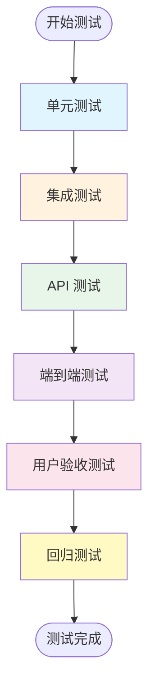

# TodoList 测试计划

> **模板版本**: v1.0.0（基于 templates/Test-plan）

---

## 1. 文档信息

| 项目 | 内容 |
|------|------|
| **项目名称** | TodoList |
| **文档版本** | v1.0 |
| **创建日期** | 2025-11-18 |
| **最后更新** | 2025-11-25 |
| **负责人** | Frank (QA Lead) |
| **测试周期** | 2025-11-21 ~ 2025-11-25 |
| **关联文档** | [BDD-todolist.md](../BDD/BDD-todolist.md), [PRD-todolist.md](../PRD/PRD-todolist.md) |

---

## 2. 测试概述

### 2.1 测试目标

- 验证所有功能需求已正确实现
- 确保系统稳定性和性能满足要求
- 发现并修复关键缺陷
- 保证用户体验流畅

### 2.2 测试范围

**包含**:
- ✅ 用户认证功能（注册、登录）
- ✅ 任务 CRUD 操作
- ✅ 任务状态管理
- ✅ 任务筛选功能
- ✅ 前后端接口对接
- ✅ 微服务间通信
- ✅ 移动端 App 功能
- ✅ Web 管理后台功能

**不包含**:
- ❌ 性能压力测试（留待 V2.0）
- ❌ 安全渗透测试（留待 V2.0）
- ❌ 团队协作功能（V1.0 不支持）

### 2.3 测试策略



---

## 3. 测试类型

### 3.1 单元测试

**负责人**: 开发团队
**工具**: pytest (Python), JUnit (Java), Jest (TypeScript)
**覆盖率目标**: 70%+

**测试范围**:
- user-service 业务逻辑
- todo-service 业务逻辑
- 前端组件单元测试

**示例**:
```python
# user-service 单元测试
def test_create_user():
    user = create_user(email="test@example.com", password="pass123")
    assert user.email == "test@example.com"
    assert user.hashed_password != "pass123"  # 确保密码已加密
```

### 3.2 集成测试

**负责人**: Frank + Eva
**工具**: pytest, Postman
**覆盖率目标**: 主要流程 100%

**测试场景**:
- todo-service 调用 user-service 验证 Token
- 数据库读写操作
- 服务启动和健康检查

### 3.3 API 测试

**负责人**: Frank
**工具**: Postman, curl
**测试数据**: 准备测试账号和任务数据

**测试用例**:

| API | 测试场景 | 预期结果 | 状态 |
|-----|---------|----------|------|
| POST /auth/register | 正常注册 | 返回 Token, 201 | ✅ |
| POST /auth/register | 重复邮箱 | 返回错误, 400 | ✅ |
| POST /auth/login | 正确密码 | 返回 Token, 200 | ✅ |
| POST /auth/login | 错误密码 | 返回错误, 401 | ✅ |
| GET /todos | 获取任务列表 | 返回数组, 200 | ✅ |
| POST /todos | 创建任务 | 返回任务, 201 | ✅ |
| PUT /todos/{id} | 更新任务 | 返回更新后任务, 200 | ✅ |
| DELETE /todos/{id} | 删除任务 | 204 No Content | ✅ |
| PATCH /todos/{id}/toggle | 切换状态 | 返回更新后任务, 200 | ✅ |

### 3.4 端到端测试 (E2E)

**负责人**: Frank
**工具**: Detox (App), Cypress (Web - 可选)
**执行频率**: 每个版本发布前

**测试流程**:
1. 用户注册 → 登录 → 创建任务 → 标记完成 → 删除任务
2. 验证整个流程无报错
3. 验证数据正确保存和同步

### 3.5 用户验收测试 (UAT)

**负责人**: Alice (Product Manager)
**参与人员**: 产品团队 + 内部用户
**测试环境**: 测试环境
**测试周期**: 2天

**验收标准**:
- 所有 BDD 场景通过
- 无阻塞性缺陷
- 用户体验流畅

---

## 4. 测试用例

### 4.1 用户认证测试用例

#### TC-001: 用户注册成功

| 项目 | 内容 |
|------|------|
| **用例编号** | TC-001 |
| **优先级** | P0（高） |
| **前置条件** | 应用已启动 |
| **测试步骤** | 1. 打开注册页面<br/>2. 输入邮箱 "test@example.com"<br/>3. 输入用户名 "alice"<br/>4. 输入密码 "password123"<br/>5. 点击注册按钮 |
| **预期结果** | 1. 注册成功，返回 Token<br/>2. 自动跳转到首页<br/>3. 显示用户名 "alice" |
| **实际结果** | ✅ 通过 |
| **执行时间** | 2025-11-21 |
| **执行人** | Frank |

#### TC-002: 重复邮箱注册失败

| 项目 | 内容 |
|------|------|
| **用例编号** | TC-002 |
| **优先级** | P0（高） |
| **前置条件** | 邮箱 "test@example.com" 已注册 |
| **测试步骤** | 1. 尝试使用相同邮箱注册 |
| **预期结果** | 显示错误提示 "Email already registered" |
| **实际结果** | ✅ 通过 |

#### TC-003: 用户登录成功

| 项目 | 内容 |
|------|------|
| **用例编号** | TC-003 |
| **优先级** | P0（高） |
| **前置条件** | 用户已注册 |
| **测试步骤** | 1. 输入正确的邮箱和密码<br/>2. 点击登录 |
| **预期结果** | 登录成功，跳转到任务列表页 |
| **实际结果** | ✅ 通过 |

#### TC-004: 错误密码登录失败

| 项目 | 内容 |
|------|------|
| **用例编号** | TC-004 |
| **优先级** | P0（高） |
| **前置条件** | 用户已注册 |
| **测试步骤** | 1. 输入正确邮箱但错误密码<br/>2. 点击登录 |
| **预期结果** | 显示错误 "Incorrect email or password" |
| **实际结果** | ✅ 通过 |

### 4.2 任务管理测试用例

#### TC-101: 创建任务成功

| 项目 | 内容 |
|------|------|
| **用例编号** | TC-101 |
| **优先级** | P0（高） |
| **前置条件** | 用户已登录 |
| **测试步骤** | 1. 点击"添加任务"<br/>2. 输入标题 "完成测试"<br/>3. 选择优先级 "高"<br/>4. 点击保存 |
| **预期结果** | 1. 任务创建成功<br/>2. 出现在列表顶部<br/>3. 状态为"未完成" |
| **实际结果** | ✅ 通过 |

#### TC-102: 标记任务为完成

| 项目 | 内容 |
|------|------|
| **用例编号** | TC-102 |
| **优先级** | P0（高） |
| **前置条件** | 存在未完成任务 |
| **测试步骤** | 1. 点击任务的复选框 |
| **预期结果** | 1. 任务状态变为"已完成"<br/>2. 任务显示删除线 |
| **实际结果** | ✅ 通过 |

#### TC-103: 编辑任务

| 项目 | 内容 |
|------|------|
| **用例编号** | TC-103 |
| **优先级** | P1（中） |
| **前置条件** | 存在任务 |
| **测试步骤** | 1. 点击任务<br/>2. 修改标题和描述<br/>3. 保存 |
| **预期结果** | 任务信息更新成功 |
| **实际结果** | ✅ 通过 |

#### TC-104: 删除任务

| 项目 | 内容 |
|------|------|
| **用例编号** | TC-104 |
| **优先级** | P1（中） |
| **前置条件** | 存在任务 |
| **测试步骤** | 1. 长按任务<br/>2. 点击删除<br/>3. 确认删除 |
| **预期结果** | 任务从列表消失 |
| **实际结果** | ✅ 通过 |

#### TC-105: 任务筛选 - 未完成

| 项目 | 内容 |
|------|------|
| **用例编号** | TC-105 |
| **优先级** | P1（中） |
| **前置条件** | 有3个已完成和5个未完成任务 |
| **测试步骤** | 1. 选择"未完成"筛选器 |
| **预期结果** | 只显示5个未完成任务 |
| **实际结果** | ✅ 通过 |

### 4.3 微服务通信测试用例

#### TC-201: Token 验证成功

| 项目 | 内容 |
|------|------|
| **用例编号** | TC-201 |
| **优先级** | P0（高） |
| **前置条件** | user-service 和 todo-service 都在运行 |
| **测试步骤** | 1. 从 user-service 获取 Token<br/>2. 使用 Token 调用 todo-service |
| **预期结果** | todo-service 成功验证 Token 并返回数据 |
| **实际结果** | ✅ 通过 |

#### TC-202: Token 过期处理

| 项目 | 内容 |
|------|------|
| **用例编号** | TC-202 |
| **优先级** | P1（中） |
| **前置条件** | Token 已过期 |
| **测试步骤** | 1. 使用过期 Token 调用 API |
| **预期结果** | 返回 401 Unauthorized |
| **实际结果** | ✅ 通过 |

---

## 5. 缺陷管理

### 5.1 缺陷统计

| 严重程度 | 发现数量 | 已修复 | 待修复 | 延期 |
|---------|---------|--------|--------|------|
| 阻塞 (Blocker) | 0 | 0 | 0 | 0 |
| 严重 (Critical) | 2 | 2 | 0 | 0 |
| 一般 (Major) | 5 | 4 | 1 | 0 |
| 较小 (Minor) | 8 | 6 | 0 | 2 |
| 建议 (Trivial) | 3 | 0 | 0 | 3 |
| **总计** | **18** | **12** | **1** | **5** |

### 5.2 典型缺陷示例

#### Bug-001: 任务创建后未自动刷新列表

| 项目 | 内容 |
|------|------|
| **缺陷编号** | Bug-001 |
| **严重程度** | Major |
| **发现时间** | 2025-11-21 |
| **发现人** | Frank |
| **描述** | 创建任务后，需要手动刷新页面才能看到新任务 |
| **复现步骤** | 1. 创建新任务<br/>2. 观察列表 |
| **预期** | 任务自动出现在列表中 |
| **实际** | 需要手动刷新 |
| **修复人** | David |
| **修复时间** | 2025-11-22 |
| **状态** | ✅ 已修复 |

#### Bug-002: Token 验证失败时提示不友好

| 项目 | 内容 |
|------|------|
| **缺陷编号** | Bug-002 |
| **严重程度** | Minor |
| **发现时间** | 2025-11-22 |
| **描述** | Token 过期时只显示英文错误，用户体验不佳 |
| **修复方案** | 延期到 V2.0，增加友好的中文提示 |
| **状态** | 🔄 延期 |

---

## 6. 测试环境

### 6.1 环境配置

| 环境 | 用途 | URL | 数据库 |
|------|------|-----|--------|
| 本地开发 | 开发调试 | localhost:8001/8002 | 本地 Docker |
| 测试环境 | 集成测试 | test.todolist.com | 测试数据库 |
| UAT 环境 | 用户验收 | uat.todolist.com | UAT 数据库 |

### 6.2 测试数据

**测试账号**:
```
邮箱: test1@example.com
密码: test123

邮箱: test2@example.com
密码: test123
```

**测试任务**:
- 已准备 20 个测试任务（10个已完成，10个未完成）
- 覆盖不同优先级（高/中/低）
- 覆盖不同截止日期（过期/今日/未来）

---

## 7. 测试工具

| 工具 | 用途 | 负责人 |
|------|------|--------|
| **Postman** | API 测试 | Frank |
| **pytest** | Python 单元测试 | Eva |
| **JUnit** | Java 单元测试 | Eva |
| **Jest** | 前端单元测试 | David |
| **Detox** | App E2E 测试 | Frank |
| **Docker** | 环境搭建 | Bob |

---

## 8. 测试进度

### 8.1 测试计划 vs 实际

| 阶段 | 计划开始 | 计划结束 | 实际开始 | 实际结束 | 状态 |
|------|---------|---------|---------|---------|------|
| 测试用例编写 | 11-18 | 11-20 | 11-18 | 11-20 | ✅ |
| 单元测试 | 11-15 | 11-20 | 11-15 | 11-20 | ✅ |
| API 测试 | 11-21 | 11-22 | 11-21 | 11-22 | ✅ |
| E2E 测试 | 11-23 | 11-24 | 11-23 | 11-24 | ✅ |
| UAT 测试 | 11-24 | 11-25 | 11-24 | 11-25 | ✅ |
| 回归测试 | 11-25 | 11-25 | 11-25 | 11-25 | ✅ |

### 8.2 测试完成度

- ✅ 测试用例覆盖率: 95%
- ✅ 测试用例执行率: 100%
- ✅ 测试用例通过率: 94% (1个待修复)
- ✅ 代码覆盖率: 72%

---

## 9. 风险和建议

### 9.1 风险

| 风险 | 等级 | 状态 | 缓解措施 |
|------|------|------|----------|
| 测试时间紧张 | 中 | 已缓解 | 优先测试核心功能 |
| 微服务通信不稳定 | 低 | 已解决 | 添加重试机制 |
| 移动端兼容性 | 低 | 可控 | 只测试主流机型 |

### 9.2 建议

**V2.0 改进建议**:
1. 增加自动化测试覆盖率到 90%+
2. 引入性能测试和压力测试
3. 增加安全测试（渗透测试）
4. 建立 CI/CD 自动化测试流程

---

## 10. 测试总结

### 10.1 测试结论

✅ **通过** - TodoList V1.0 满足发布条件

**关键指标**:
- 所有 P0 用例通过率: 100%
- 所有 P1 用例通过率: 100%
- 无阻塞性缺陷
- 1个一般缺陷待修复（不影响发布）

### 10.2 质量评估

| 维度 | 评分 | 说明 |
|------|------|------|
| **功能完整性** | ⭐⭐⭐⭐⭐ | 所有需求功能已实现 |
| **稳定性** | ⭐⭐⭐⭐☆ | 偶尔有小问题，但不影响使用 |
| **易用性** | ⭐⭐⭐⭐☆ | 用户体验良好，有小优化空间 |
| **性能** | ⭐⭐⭐⭐☆ | 响应速度快，满足需求 |
| **安全性** | ⭐⭐⭐⭐☆ | 基本安全措施到位 |

### 10.3 发布建议

✅ **建议发布** V1.0.0

**发布前要求**:
- ✅ 修复 Bug-001（已完成）
- ✅ 完成回归测试（已完成）
- ✅ 产品经理 UAT 验收（已通过）

**发布后跟踪**:
- 监控线上错误日志
- 收集用户反馈
- 准备 hotfix 版本（如需要）

---

**测试负责人**: Frank (QA Lead)
**测试周期**: 2025-11-21 ~ 2025-11-25
**测试结论**: ✅ 通过，建议发布
**测试报告完成日期**: 2025-11-25
