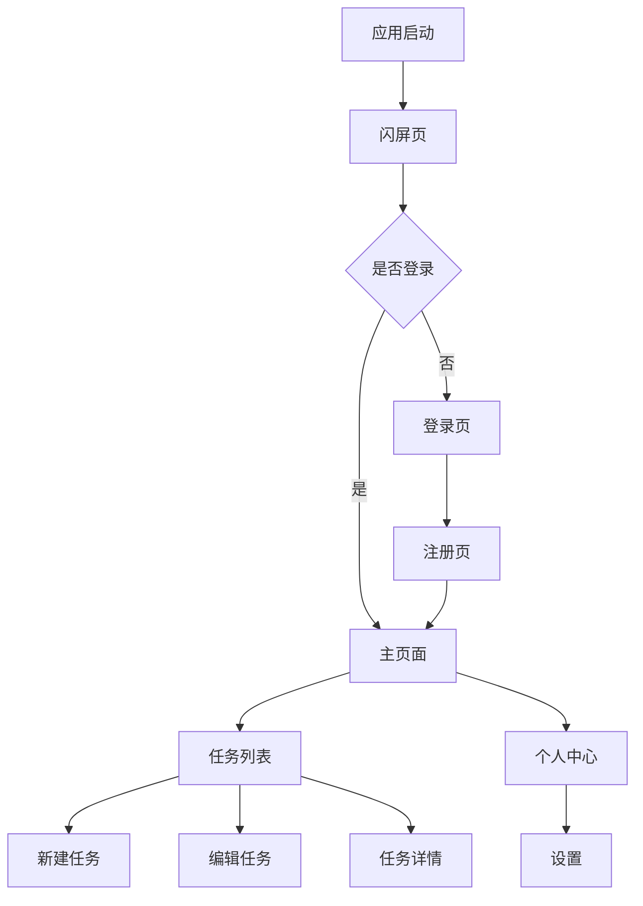
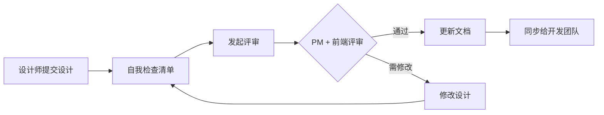

# TodoList UI/交互设计规范

> **模板版本**: v1.0.0 | **最后更新**: 2025-10-31

---

## 1. 文档信息

| 项目 | 内容 |
|------|------|
| **项目名称** | TodoList |
| **文档版本** | v1.0 |
| **创建日期** | 2025-10-20 |
| **最后更新** | 2025-10-31 |
| **负责人** | Grace (UI/UX Designer) |
| **评审状态** | ✅ 已批准 |
| **关联文档** | [PRD-todolist.md](../PRD/PRD-todolist.md) |

### 文档修订记录

| 版本 | 日期 | 修订人 | 修订内容 |
|------|------|--------|----------|
| v0.1 | 2025-10-20 | Grace | 初稿，移动端设计 |
| v0.5 | 2025-10-25 | Grace | 添加 Web Admin 设计 |
| v1.0 | 2025-10-31 | Grace | 正式版，评审通过 |

---

## 2. 设计概述

### 2.1 设计目标

**核心目标**:
- **简洁高效**: 专注任务管理核心功能，避免干扰
- **现代美观**: 采用 Material Design 3 设计语言
- **多端统一**: 移动端和 Web 端保持视觉一致性
- **易于上手**: 零学习成本，符合用户直觉

### 2.2 设计原则

1. **内容优先 (Content First)**
   - 任务内容是核心，UI 为内容服务
   - 减少装饰性元素
   - 合理使用留白

2. **一致性 (Consistency)**
   - 颜色、字体、间距统一
   - 交互模式可预测
   - 跨平台体验一致

3. **即时反馈 (Immediate Feedback)**
   - 所有操作有明确反馈
   - 加载状态清晰
   - 错误提示友好

4. **渐进式信息披露 (Progressive Disclosure)**
   - 默认显示核心功能
   - 高级功能隐藏在菜单中
   - 避免认知过载

### 2.3 目标用户

| 用户类型 | 特征 | 设计考量 |
|---------|------|----------|
| 主要用户 | 20-35岁，白领，技术熟练 | 现代化界面，快捷键支持 |
| 次要用户 | 35-50岁，管理人员 | 清晰的文字标签，容错设计 |

---

## 3. 视觉设计规范

### 3.1 品牌色

**主色 (Primary)**:
- Primary: `#6200EE` (深紫色)
  - 用途: 主要按钮、FAB、链接、选中状态
  - RGB: (98, 0, 238)
  - 变体:
    - Light: `#9D46FF`
    - Dark: `#3700B3`

**辅助色 (Secondary)**:
- Secondary: `#03DAC6` (青色)
  - 用途: 次要操作、高亮、提示
  - RGB: (3, 218, 198)

**功能色**:
- Success: `#4CAF50` (绿色) - 完成状态
- Warning: `#FF9800` (橙色) - 警告
- Error: `#B00020` (红色) - 错误
- Info: `#2196F3` (蓝色) - 信息提示

**优先级色**:
- High: `#F44336` (红色) - 高优先级
- Medium: `#FF9800` (橙色) - 中优先级
- Low: `#9E9E9E` (灰色) - 低优先级

**中性色**:
- Text Primary: `#212121` (87% 不透明度)
- Text Secondary: `#757575` (60% 不透明度)
- Divider: `#E0E0E0` (12% 不透明度)
- Background: `#FFFFFF`
- Surface: `#F5F5F5`

```
色板示例：
[#6200EE] [#03DAC6] [#4CAF50] [#FF9800] [#B00020]
```

### 3.2 字体规范

**移动端 (iOS/Android)**:
- iOS: SF Pro Text / SF Pro Display
- Android: Roboto
- 中文: PingFang SC (iOS) / Noto Sans CJK SC (Android)

**Web 端**:
```css
font-family: -apple-system, BlinkMacSystemFont, 'Segoe UI',
             'Roboto', 'Helvetica Neue', 'Arial',
             'PingFang SC', 'Hiragino Sans GB', 'Microsoft YaHei',
             sans-serif;
```

**字号体系**:
| 用途 | 字号 | 行高 | 字重 | 使用场景 |
|------|------|------|------|----------|
| H1 | 28px | 36px | Bold (700) | 页面标题 |
| H2 | 24px | 32px | SemiBold (600) | 区块标题 |
| H3 | 20px | 28px | SemiBold (600) | 小标题 |
| Body Large | 16px | 24px | Regular (400) | 任务标题 |
| Body | 14px | 20px | Regular (400) | 任务描述、正文 |
| Caption | 12px | 16px | Regular (400) | 辅助信息、时间 |
| Button | 14px | 20px | Medium (500) | 按钮文字 |

### 3.3 间距规范

**基础单位**: 8px (0.5rem)

**间距体系**:
- xxs: 2px (0.25 × 基础单位) - 极小间距
- xs: 4px (0.5 × 基础单位) - 小间距
- sm: 8px (1 × 基础单位) - 标准小间距
- md: 16px (2 × 基础单位) - 标准间距
- lg: 24px (3 × 基础单位) - 大间距
- xl: 32px (4 × 基础单位) - 超大间距
- xxl: 48px (6 × 基础单位) - 页面级间距

**使用场景**:
- 元素内边距: sm-md (8-16px)
- 列表项间距: xs (4px)
- 卡片间距: md (16px)
- 模块间距: lg-xl (24-32px)
- 页面边距: md (16px)

### 3.4 圆角规范

| 类型 | 圆角值 | 使用场景 |
|------|--------|----------|
| 无圆角 | 0px | 分割线 |
| 小圆角 | 4px | 芯片(Chip)、标签 |
| 中圆角 | 8px | 按钮、输入框 |
| 大圆角 | 12px | 卡片、对话框 |
| 超大圆角 | 16px | FAB、底部弹窗 |
| 圆形 | 50% | 头像、图标按钮 |

### 3.5 阴影规范

**Material Design 阴影层级**:
```css
/* 层级 1 - 轻微抬升 (卡片) */
box-shadow: 0 1px 3px rgba(0, 0, 0, 0.12),
            0 1px 2px rgba(0, 0, 0, 0.24);

/* 层级 2 - 中度抬升 (悬停卡片) */
box-shadow: 0 3px 6px rgba(0, 0, 0, 0.15),
            0 2px 4px rgba(0, 0, 0, 0.12);

/* 层级 3 - 高抬升 (FAB) */
box-shadow: 0 10px 20px rgba(0, 0, 0, 0.15),
            0 3px 6px rgba(0, 0, 0, 0.10);

/* 层级 4 - 最高抬升 (对话框) */
box-shadow: 0 15px 25px rgba(0, 0, 0, 0.15),
            0 5px 10px rgba(0, 0, 0, 0.05);
```

---

## 4. 信息架构

### 4.1 页面结构



### 4.2 导航结构

**移动端 App - 底部 Tab 导航**:
```
┌─────────────────────────────┐
│                             │
│        页面内容区域          │
│                             │
└─────────────────────────────┘
┌──────────┬──────────────────┐
│ 📝 任务  │  👤 我的         │
│  (选中)  │                  │
└──────────┴──────────────────┘
```

**Web Admin - 侧边栏导航**:
```
┌─────┬───────────────────────┐
│ Logo│                       │
│ ──  │   Dashboard           │
│ 📊  │   ┌─────┬─────┬─────┐│
│ 仪表│   │统计1│统计2│统计3││
│ 板  │   └─────┴─────┴─────┘│
│     │                       │
│ 📝  │   任务管理             │
│ 任务│   [任务列表表格]       │
│     │                       │
│ 👥  │                       │
│ 用户│                       │
└─────┴───────────────────────┘
```

---

## 5. 组件设计规范

### 5.1 按钮 (Button)

**主要按钮 (Primary Filled)**:
```
┌──────────────────┐
│   完成任务       │  ← 高度: 40px
└──────────────────┘     圆角: 8px
                         背景: #6200EE
                         文字: White
```

**规范**:
- 背景色: Primary Color (#6200EE)
- 文字色: White
- 高度: 40px (移动端), 36px (Web)
- 圆角: 8px
- 最小宽度: 64px
- 内边距: 16px (左右)

**次要按钮 (Outlined)**:
- 边框: 1px solid #6200EE
- 背景: 透明
- 文字色: #6200EE

**文字按钮 (Text)**:
- 无边框、无背景
- 文字色: #6200EE
- 用于取消、返回等操作

**禁用状态**:
- 背景色: #E0E0E0
- 文字色: #9E9E9E
- 不可点击

**悬停状态** (Web):
- 背景色加深 10%
- 显示阴影: box-shadow 层级2

### 5.2 浮动操作按钮 (FAB)

```
        ┌─────┐
        │  +  │  ← 56x56px 圆形
        └─────┘     背景: Primary
                    图标: White
                    阴影: 层级3
```

**规范**:
- 尺寸: 56 × 56px (标准), 40 × 40px (小)
- 圆角: 50%
- 背景: Primary Color
- 图标: 24 × 24px, White
- 阴影: 层级3
- 位置: 右下角，距边缘 16px

**使用场景**: 新建任务

### 5.3 输入框 (Input)

**默认状态**:
```
┌──────────────────────────────┐
│ 任务标题                      │
└──────────────────────────────┘
```

**规范**:
- 高度: 48px (移动端), 40px (Web)
- 内边距: 12px (上下), 16px (左右)
- 边框: 1px solid #E0E0E0
- 圆角: 8px
- 字号: 14px
- 占位符颜色: #9E9E9E

**聚焦状态**:
- 边框: 2px solid #6200EE
- 添加阴影: 0 0 0 3px rgba(98, 0, 238, 0.1)

**错误状态**:
- 边框: 2px solid #B00020
- 下方显示错误提示: 12px, #B00020

**多行输入** (任务描述):
- 最小高度: 80px
- 可自动扩展

### 5.4 任务卡片 (Task Card)

```
┌──────────────────────────────┐
│ ⭕ 完成用户注册功能           │ ← 标题 (16px, Bold)
│    前端和后端都需要实现       │ ← 描述 (14px, Regular)
│    ⏰ 2025-11-15  🔴 高优先级 │ ← 元信息 (12px)
└──────────────────────────────┘
```

**规范**:
- 背景: White
- 圆角: 12px
- 阴影: 层级1
- 内边距: 16px
- 最小高度: 72px

**状态指示**:
- 未完成: ⭕ 空心圆圈 (#757575)
- 已完成: ✅ 实心对勾 (#4CAF50)，文字添加删除线

**优先级标识**:
- 高: 🔴 红色圆点 + "高" 文字
- 中: 🟠 橙色圆点 + "中" 文字
- 低: ⚪ 灰色圆点 + "低" 文字

**交互**:
- 点击整张卡片: 进入编辑模式
- 点击圆圈: 切换完成状态
- 左滑 (移动端): 显示删除按钮

### 5.5 列表 (List)

**任务列表**:
```
┌──────────────────────────────┐
│ ⭕ 任务1                      │
│    描述...                    │
├──────────────────────────────┤ ← 分割线: 1px #E0E0E0
│ ✅ 任务2 (已完成)             │
│    描述...                    │
├──────────────────────────────┤
│ ⭕ 任务3                      │
│    描述...                    │
└──────────────────────────────┘
```

**规范**:
- 列表项高度: 自适应，最小 72px
- 内边距: 16px
- 分割线: 1px solid #E0E0E0，左右各缩进 16px
- 点击态: 背景色 #F5F5F5

**空状态**:
```
        📝
    暂无任务
  点击 + 号创建新任务
```

### 5.6 对话框 (Dialog)

**确认对话框**:
```
      ┌──────────────────┐
      │ 删除任务         │ ← 标题 (20px, SemiBold)
      ├──────────────────┤
      │ 确定要删除这个   │ ← 内容 (14px)
      │ 任务吗？此操作   │
      │ 不可撤销。       │
      ├──────────────────┤
      │  取消     确定    │ ← 按钮 (右对齐)
      └──────────────────┘
```

**规范**:
- 宽度: 最大 280px (移动端), 400px (Web)
- 圆角: 12px
- 内边距: 24px
- 遮罩: rgba(0, 0, 0, 0.5)
- 动画: 淡入 + 缩放 (200ms)

**按钮布局**:
- 取消按钮: Text Button, 靠右
- 确定按钮: Text Button (Primary Color), 最右

### 5.7 芯片 (Chip)

**优先级芯片**:
```
┌──────┐  ┌──────┐  ┌──────┐
│🔴 高 │  │🟠 中 │  │⚪ 低 │
└──────┘  └──────┘  └──────┘
```

**规范**:
- 高度: 32px
- 圆角: 16px
- 内边距: 12px (左右)
- 字号: 12px
- 背景色:
  - 高: #FFEBEE (浅红)
  - 中: #FFF3E0 (浅橙)
  - 低: #FAFAFA (浅灰)

---

## 6. 页面设计

### 6.1 登录页 (Login Screen)

**设计目标**:
- 简洁友好的登录体验
- 清晰的错误提示
- 快速切换到注册页

**线框图**:
```
┌─────────────────────────────┐
│                             │
│          📝                 │ ← Logo (80x80px)
│        TodoList             │ ← App名称 (28px)
│                             │
│  ┌─────────────────────┐   │
│  │ 📧 邮箱             │   │ ← 邮箱输入框
│  └─────────────────────┘   │
│                             │
│  ┌─────────────────────┐   │
│  │ 🔒 密码             │   │ ← 密码输入框
│  └─────────────────────┘   │
│                             │
│  ┌─────────────────────┐   │
│  │      登 录          │   │ ← 登录按钮 (Primary)
│  └─────────────────────┘   │
│                             │
│      还没有账号？注册       │ ← Text Button
│                             │
└─────────────────────────────┘
```

**设计说明**:
1. **Logo**: 居中显示，48px 上边距
2. **输入框**: 间距 16px，显示图标提示
3. **登录按钮**: 24px 上边距，全宽按钮
4. **注册链接**: 16px 上边距，Text Button

**交互**:
- 输入框获得焦点时显示聚焦状态
- 登录失败显示错误提示（红色文字）
- 登录成功显示 Loading 动画，跳转到任务列表

**Figma 链接**: https://figma.com/file/todolist-login

---

### 6.2 任务列表页 (Task List Screen)

**设计目标**:
- 快速浏览所有任务
- 一键完成任务
- 快速新建任务

**线框图**:
```
┌─────────────────────────────┐
│ ☰ TodoList          🔍  👤 │ ← App Bar (56px)
├─────────────────────────────┤
│ [ 全部 ] [ 未完成 ] [ 已完成 ]│ ← Tab筛选 (48px)
├─────────────────────────────┤
│                             │
│ ┌─────────────────────────┐│
│ │⭕ 完成用户认证功能      ││ ← 任务卡片1
│ │  添加JWT验证           ││
│ │  ⏰ 11-15  🔴 高       ││
│ └─────────────────────────┘│
│                             │
│ ┌─────────────────────────┐│
│ │✅ 设计数据库表结构      ││ ← 任务卡片2 (已完成)
│ │  ⏰ 11-10  🟠 中       ││
│ └─────────────────────────┘│
│                             │
│ ┌─────────────────────────┐│
│ │⭕ 编写API文档           ││ ← 任务卡片3
│ │  ⏰ 11-20  ⚪ 低       ││
│ └─────────────────────────┘│
│                             │
│                       ┌───┐ │
│                       │ + │ │ ← FAB (56x56px)
│                       └───┘ │
└─────────────────────────────┘
```

**设计说明**:
1. **App Bar**: 包含菜单、标题、搜索、用户头像
2. **Tab 筛选**: 3个Tab，Material Design 风格
3. **任务卡片**: 16px 间距，显示核心信息
4. **FAB**: 固定在右下角，点击新建任务

**交互**:
- 点击任务卡片: 进入编辑页
- 点击完成圆圈: 切换完成状态（动画过渡）
- 左滑任务卡片: 显示删除按钮
- 下拉刷新: 刷新任务列表
- 上拉加载: 加载更多任务（如有分页）

**Figma 链接**: https://figma.com/file/todolist-task-list

---

### 6.3 新建/编辑任务页 (Create/Edit Task Screen)

**设计目标**:
- 专注输入任务信息
- 清晰的字段标签
- 保存和取消操作明确

**线框图**:
```
┌─────────────────────────────┐
│ ✕ 新建任务              保存 │ ← App Bar
├─────────────────────────────┤
│                             │
│ 任务标题                    │ ← Label (12px)
│ ┌─────────────────────────┐│
│ │ 输入任务标题...         ││ ← Input (48px)
│ └─────────────────────────┘│
│                             │
│ 任务描述 (可选)             │
│ ┌─────────────────────────┐│
│ │                         ││ ← TextArea (80px)
│ │ 输入详细描述...         ││
│ │                         ││
│ └─────────────────────────┘│
│                             │
│ 优先级                      │
│ ┌───┐ ┌───┐ ┌───┐          │
│ │🔴│ │🟠│ │⚪│           │ ← 芯片选择器
│ │高│ │中│ │低│           │
│ └───┘ └───┘ └───┘          │
│                             │
│ 截止日期 (可选)             │
│ ┌─────────────────────────┐│
│ │ 📅 选择日期...          ││ ← 日期选择器
│ └─────────────────────────┘│
│                             │
└─────────────────────────────┘
```

**设计说明**:
1. **App Bar**: 左侧关闭按钮，右侧保存按钮
2. **标题输入**: 必填，显示 * 号
3. **描述输入**: 可选，可自动扩展高度
4. **优先级**: 默认选中"中"，单选
5. **日期选择**: 点击弹出日期选择器

**交互**:
- 标题为空时，"保存"按钮禁用
- 点击"保存": 验证数据，成功后返回列表
- 点击"✕": 如有未保存内容，弹出确认对话框
- 点击日期选择器: 弹出 Material Date Picker

**Figma 链接**: https://figma.com/file/todolist-create-task

---

### 6.4 个人中心页 (Profile Screen)

**线框图**:
```
┌─────────────────────────────┐
│ ← 个人中心                  │ ← App Bar
├─────────────────────────────┤
│                             │
│        ┌─────┐              │
│        │ 👤  │              │ ← 头像 (80x80px)
│        └─────┘              │
│       Alice Wang            │ ← 用户名 (20px)
│    alice@example.com        │ ← 邮箱 (14px)
│                             │
├─────────────────────────────┤
│                             │
│  📊 统计信息                │
│  ┌────────┬────────────┐   │
│  │  15    │    12      │   │ ← 数字 (24px)
│  │ 总任务 │  已完成    │   │ ← 标签 (12px)
│  └────────┴────────────┘   │
│                             │
├─────────────────────────────┤
│                             │
│  ⚙️ 设置                    │ ← 列表项
│  🔔 通知                    │
│  🌙 深色模式  [  OFF  ]     │ ← 开关
│  🚪 退出登录                │
│                             │
└─────────────────────────────┘
```

**设计说明**:
1. **用户信息**: 居中显示，包含头像、用户名、邮箱
2. **统计卡片**: 显示总任务数和已完成数
3. **设置列表**: 常用设置项

**交互**:
- 点击头像: 可更换头像 (V2.0 功能)
- 点击"设置": 进入设置页面
- 深色模式开关: 实时切换主题
- 点击"退出登录": 弹出确认对话框

**Figma 链接**: https://figma.com/file/todolist-profile

---

### 6.5 Web Admin - 仪表盘 (Dashboard)

**设计目标**:
- 一目了然的数据概览
- 快速导航到具体管理页面

**线框图**:
```
┌─────┬───────────────────────┐
│     │  Dashboard            │
│ 📊  ├───────────────────────┤
│仪表盘│  ┌─────┬─────┬─────┐ │
│     │  │ 125 │  89 │  36 │ │ ← 统计卡片
│ 📝  │  │总任务│ 完成│未完成││
│任务  │  └─────┴─────┴─────┘ │
│     │                       │
│ 👥  │  ┌──────────────────┐ │
│用户  │  │ 任务完成趋势图    │ │ ← 折线图
│     │  │   📈              │ │
│     │  └──────────────────┘ │
│     │                       │
│     │  最近任务              │
│     │  ┌──────────────────┐ │
│     │  │ 任务1  |  用户A  │ │ ← 表格
│     │  │ 任务2  |  用户B  │ │
│     │  └──────────────────┘ │
└─────┴───────────────────────┘
```

**设计说明**:
1. **侧边栏**: 固定宽度 240px，深色背景
2. **统计卡片**: 3列布局，显示关键指标
3. **图表**: 使用 Chart.js 或 ECharts
4. **最近任务表格**: 显示最新创建的5条任务

**响应式**:
- < 960px: 侧边栏收起为图标
- < 600px: 统计卡片改为单列

**Figma 链接**: https://figma.com/file/todolist-admin-dashboard

---

### 6.6 Web Admin - 任务管理 (Task Management)

**线框图**:
```
┌─────┬───────────────────────────────────┐
│     │  任务管理                          │
│ 📝  ├───────────────────────────────────┤
│任务  │  [搜索] [筛选▼] [新建任务]        │
│     ├───────────────────────────────────┤
│     │ ┌─────────────────────────────┐   │
│     │ │ ID│标题    │用户│状态│操作 │   │ ← 表格头
│     │ ├─────────────────────────────┤   │
│     │ │ 1 │认证功能│Alice│完成│编辑│   │
│     │ │ 2 │API文档│Bob  │进行│编辑│   │
│     │ │ 3 │UI设计 │Grace│未开│编辑│   │
│     │ └─────────────────────────────┘   │
│     │ [<] 1 / 5 [>]                     │ ← 分页
└─────┴───────────────────────────────────┘
```

**设计说明**:
1. **搜索**: 实时搜索任务标题
2. **筛选**: 按状态、优先级、用户筛选
3. **表格**: 显示任务列表，支持排序
4. **操作**: 编辑、删除按钮

**交互**:
- 点击表格行: 高亮显示
- 点击"编辑": 弹出编辑对话框
- 点击"删除": 确认后删除

**Figma 链接**: https://figma.com/file/todolist-admin-tasks

---

## 7. 交互设计

### 7.1 手势操作 (移动端)

| 手势 | 操作 | 响应 | 动画 |
|------|------|------|------|
| 点击 (Tap) | 任务卡片 | 进入编辑页 | 页面滑入 (300ms) |
| 点击 (Tap) | 完成圆圈 | 切换完成状态 | 圆圈填充动画 (200ms) |
| 长按 (Long Press) | 任务卡片 | 显示快捷菜单 | 震动反馈 + 菜单弹出 |
| 左滑 (Swipe Left) | 任务卡片 | 显示删除按钮 | 滑动动画 (250ms) |
| 下拉 (Pull Down) | 任务列表 | 刷新数据 | 下拉刷新动画 |
| 上拉 (Pull Up) | 任务列表 | 加载更多 | Loading 指示器 |

### 7.2 状态反馈

**加载状态**:
```
移动端:
    ⭕
   Loading...  ← 圆形进度指示器 (Primary Color)

Web端:
   ━━━━━━━━  ← 线性进度条
```

**空状态**:
```
        📝
     暂无任务
   点击 + 号创建新任务
   ───────────────
   [  创建第一个任务  ] ← 文字按钮
```

**错误状态**:
```
        ⚠️
     加载失败
   请检查网络连接后重试
   ───────────────
   [  重 试  ] ← Primary 按钮
```

**成功反馈**:
- Toast 提示: "任务已保存" (2秒后自动消失)
- Snackbar (Material): 底部弹出，可撤销操作

### 7.3 动画设计

**基础动画**:
| 场景 | 动画 | 时长 | 缓动函数 |
|------|------|------|----------|
| 页面切换 | 滑动 | 300ms | cubic-bezier(0.4, 0, 0.2, 1) |
| 对话框出现 | 淡入 + 缩放 | 200ms | cubic-bezier(0, 0, 0.2, 1) |
| 按钮点击 | 波纹效果 | 300ms | Material ripple |
| 任务完成 | 对勾动画 + 删除线 | 400ms | ease-out |
| FAB 点击 | 旋转 45° | 200ms | ease-in-out |
| 卡片出现 | 淡入 + 上移 | 150ms | ease-out |

**复杂动画**:
1. **任务完成动画**:
   - 空心圆 → 实心对勾 (200ms)
   - 文字添加删除线 (200ms, delay 100ms)
   - 整张卡片淡化至 60% 不透明度 (300ms)

2. **左滑删除动画**:
   - 卡片左移 (250ms)
   - 显示红色删除按钮 (同步)
   - 确认删除后，卡片缩小并淡出 (300ms)

3. **FAB 展开动画** (V2.0):
   - FAB 旋转 45°
   - 弹出多个小 FAB (级联动画)

**缓动函数**:
```css
/* Material Design 标准缓动 */
--md-easing-standard: cubic-bezier(0.4, 0.0, 0.2, 1);

/* 进入 */
--md-easing-decelerate: cubic-bezier(0.0, 0.0, 0.2, 1);

/* 退出 */
--md-easing-accelerate: cubic-bezier(0.4, 0.0, 1, 1);
```

---

## 8. 响应式设计

### 8.1 断点规范

| 断点 | 设备 | 宽度范围 | 布局调整 |
|------|------|----------|----------|
| xs | 手机竖屏 | < 600px | 单列，全宽 |
| sm | 手机横屏/小平板 | 600px - 960px | 单列，最大宽度 600px |
| md | 平板 | 960px - 1280px | 2列，侧边栏收起 |
| lg | 桌面 | 1280px - 1920px | 2-3列，侧边栏展开 |
| xl | 大屏 | > 1920px | 3列，最大宽度 1920px |

### 8.2 适配策略

**移动端优先 (Mobile First)**:
```css
/* 默认样式 (移动端) */
.task-card {
  width: 100%;
  padding: 16px;
}

/* 平板及以上 */
@media (min-width: 960px) {
  .task-card {
    width: 48%;
    padding: 20px;
  }
}

/* 桌面及以上 */
@media (min-width: 1280px) {
  .task-card {
    width: 32%;
    padding: 24px;
  }
}
```

**布局调整**:
- **移动端 (< 600px)**:
  - 单列布局
  - 底部 Tab 导航
  - FAB 操作按钮

- **平板 (600-960px)**:
  - 1-2列布局
  - 侧边栏可收起
  - 任务卡片宽度 48%

- **桌面 (> 1280px)**:
  - 2-3列布局
  - 固定侧边栏
  - 任务卡片宽度 32%
  - 显示更多信息

**字体缩放**:
- 移动端: 基础字号 14px
- 桌面端: 基础字号 16px
- 支持用户字体放大 (最大 200%)

---

## 9. 可访问性 (Accessibility)

### 9.1 对比度

遵循 WCAG 2.1 AA 级标准:

| 元素 | 前景色 | 背景色 | 对比度 | 标准 |
|------|--------|--------|--------|------|
| 正文文字 | #212121 | #FFFFFF | 16.1:1 | ✅ 通过 (4.5:1) |
| 次要文字 | #757575 | #FFFFFF | 4.6:1 | ✅ 通过 (4.5:1) |
| Primary 按钮 | #FFFFFF | #6200EE | 8.6:1 | ✅ 通过 (4.5:1) |
| 链接文字 | #6200EE | #FFFFFF | 8.6:1 | ✅ 通过 (3:1) |

### 9.2 触摸目标

遵循平台规范:

- **iOS**: 最小 44 × 44 点
- **Android**: 最小 48 × 48dp
- **Web**: 最小 44 × 44px

**实际应用**:
- 按钮: 48px 高度 (移动端)
- 复选框: 48 × 48px 触摸区域
- 列表项: 最小 56px 高度
- FAB: 56 × 56px
- 触摸目标间距: 至少 8px

### 9.3 无障碍支持

**屏幕阅读器**:
```html
<!-- 任务卡片 -->
<div
  role="article"
  aria-label="任务: 完成用户认证功能，高优先级，截止日期 11月15日"
>
  ...
</div>

<!-- FAB -->
<button
  aria-label="新建任务"
  aria-describedby="fab-tooltip"
>
  +
</button>

<!-- 复选框 -->
<input
  type="checkbox"
  aria-label="标记任务为已完成"
  aria-checked="false"
>
```

**键盘导航** (Web):
- Tab: 在可交互元素间切换
- Enter: 激活按钮/链接
- Space: 切换复选框
- Esc: 关闭对话框
- 显示焦点指示器 (outline)

**语义化 HTML**:
- 使用 `<button>` 而非 `<div onclick>`
- 使用 `<label>` 关联输入框
- 使用 `<nav>` 包裹导航
- 使用 `role` 属性标记 ARIA 角色

**文字缩放**:
- 支持系统字体缩放 (最大 200%)
- 使用相对单位 (rem, em) 而非固定 px
- 确保缩放后不出现水平滚动

---

## 10. 设计交付物

### 10.1 交付清单

- [x] Figma 设计稿（包含所有页面）
- [x] 切图资源（@1x, @2x, @3x）
- [x] 图标库（SVG 格式）
- [x] 设计规范文档（本文档）
- [x] 组件库 Figma 文件
- [x] 动效说明视频
- [x] 移动端设计稿 (iOS + Android)
- [x] Web Admin 设计稿

### 10.2 设计稿链接

**Figma 项目**:
- 主项目: https://figma.com/file/todolist-design
- 组件库: https://figma.com/file/todolist-components
- 查看权限: 所有团队成员

**分页链接**:
1. 移动端:
   - 登录页: https://figma.com/file/todolist-login
   - 注册页: https://figma.com/file/todolist-register
   - 任务列表: https://figma.com/file/todolist-task-list
   - 新建任务: https://figma.com/file/todolist-create-task
   - 个人中心: https://figma.com/file/todolist-profile

2. Web Admin:
   - 仪表盘: https://figma.com/file/todolist-admin-dashboard
   - 任务管理: https://figma.com/file/todolist-admin-tasks
   - 用户管理: https://figma.com/file/todolist-admin-users

### 10.3 设计资源

**图标库**:
- Material Icons: https://fonts.google.com/icons
- 自定义图标: https://figma.com/file/todolist-icons

**插画素材**:
- 空状态插画: /assets/illustrations/empty-state.svg
- 错误状态插画: /assets/illustrations/error-state.svg
- 成功反馈插画: /assets/illustrations/success.svg

**品牌资源**:
- Logo: /assets/brand/logo.svg (矢量)
- App Icon: /assets/brand/app-icon@3x.png (1024×1024)
- Splash Screen: /assets/brand/splash.png

---

## 11. 设计规范维护

### 11.1 更新原则

- ✅ 保持设计系统的一致性
- ✅ 重大变更需团队评审
- ✅ 及时同步到开发团队
- ✅ 版本号遵循语义化版本规则
- ✅ 所有变更记录在 Git 提交中

### 11.2 反馈机制

- **设计评审会议**: 每周三 15:00
- **问题反馈**: Slack #design 频道
- **改进建议**: [Google Form 链接]
- **Bug 报告**: GitHub Issues

### 11.3 设计评审流程



---

## 12. 参考资源

**设计系统参考**:
- [Material Design 3](https://m3.material.io/) - 本项目主要参考
- [Apple HIG](https://developer.apple.com/design/human-interface-guidelines/)
- [Ant Design](https://ant.design/) - Web Admin 参考
- [Fluent 2 Design](https://fluent2.microsoft.design/)

**设计工具**:
- Figma: 主要设计工具
- Principle: 动效原型
- Zeplin: 设计交付
- Sketch: 组件库 (可选)

**前端组件库**:
- React Native Paper: 移动端 Material Design
- Ant Design React: Web Admin
- Material-UI: 备选方案

**颜色工具**:
- [Material Color Tool](https://material.io/resources/color/)
- [Coolors](https://coolors.co/)
- [WebAIM Contrast Checker](https://webaim.org/resources/contrastchecker/)

**动效参考**:
- [Material Motion](https://material.io/design/motion/)
- [Cubic Bezier Generator](https://cubic-bezier.com/)

---

## 附录 A: 开发对接指南

### A.1 前端实现建议

**移动端 (React Native)**:
```bash
# 推荐使用 React Native Paper (Material Design)
npm install react-native-paper

# 或使用 React Native Elements
npm install @rneui/themed @rneui/base
```

**Web Admin (React)**:
```bash
# 推荐使用 Ant Design
npm install antd

# 或使用 Material-UI
npm install @mui/material @emotion/react @emotion/styled
```

### A.2 设计 Token 导出

```javascript
// design-tokens.js
export const colors = {
  primary: '#6200EE',
  primaryLight: '#9D46FF',
  primaryDark: '#3700B3',
  secondary: '#03DAC6',
  // ...
};

export const spacing = {
  xxs: 2,
  xs: 4,
  sm: 8,
  md: 16,
  lg: 24,
  xl: 32,
  xxl: 48,
};

export const typography = {
  h1: {
    fontSize: 28,
    lineHeight: 36,
    fontWeight: '700',
  },
  // ...
};
```

### A.3 组件实现清单

| 组件 | 优先级 | 负责人 | 状态 |
|------|--------|--------|------|
| Button | P0 | David | ✅ 完成 |
| Input | P0 | David | ✅ 完成 |
| TaskCard | P0 | David | ✅ 完成 |
| FAB | P0 | David | ✅ 完成 |
| Dialog | P1 | David | ✅ 完成 |
| Chip | P1 | David | ✅ 完成 |

---

**设计负责人**: Grace (UI/UX Designer)
**评审人员**: Alice (PM), David (Frontend Lead), Bob (Tech Lead)
**批准日期**: 2025-10-31

---

**注意事项**:
- ✅ 本文档为设计规范，开发时需严格遵守
- ✅ 如有疑问请及时与设计团队沟通
- ✅ 设计规范会根据项目进展持续更新
- ✅ 使用 Git 管理文档版本，文件名不带版本号
