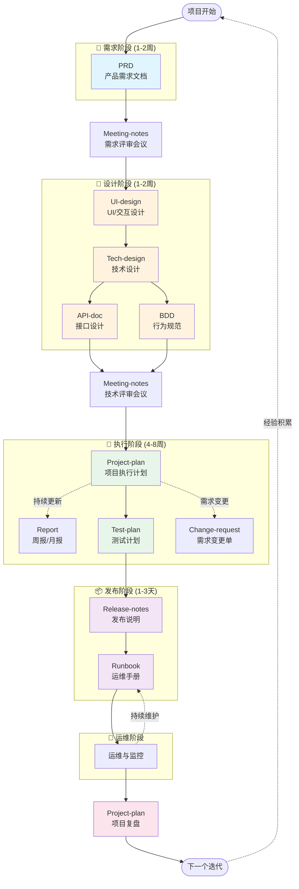
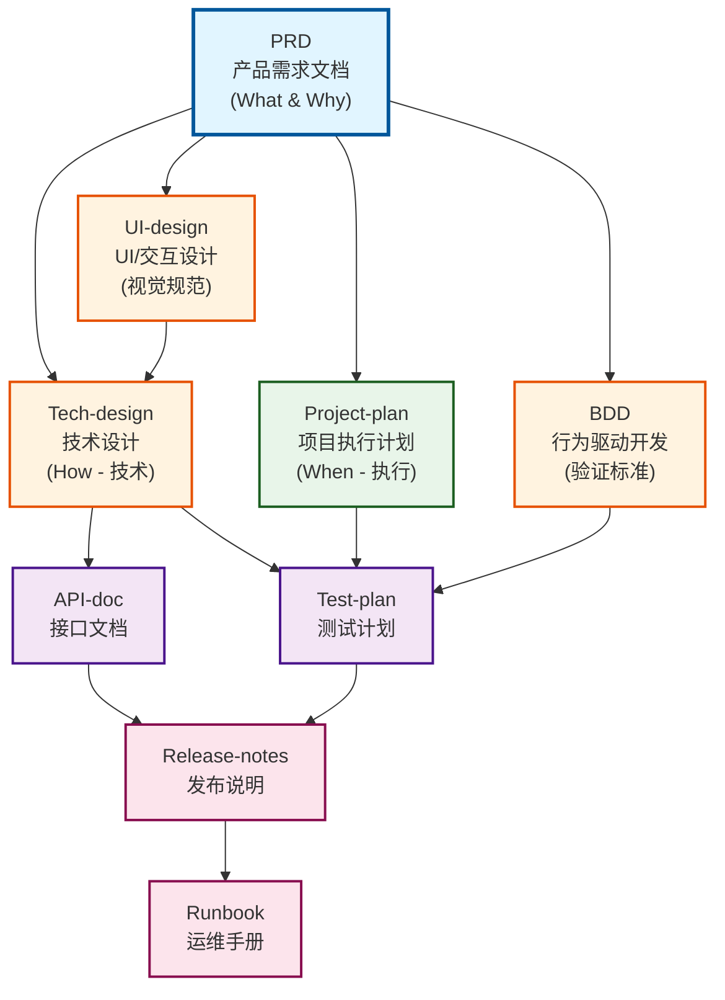
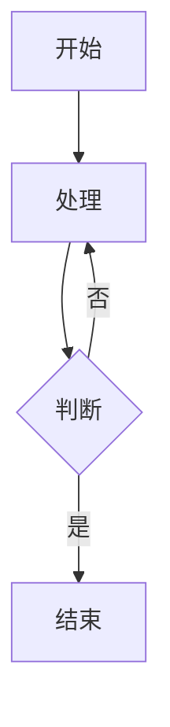
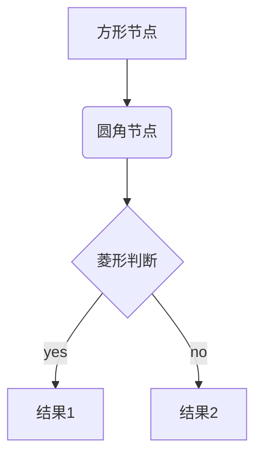
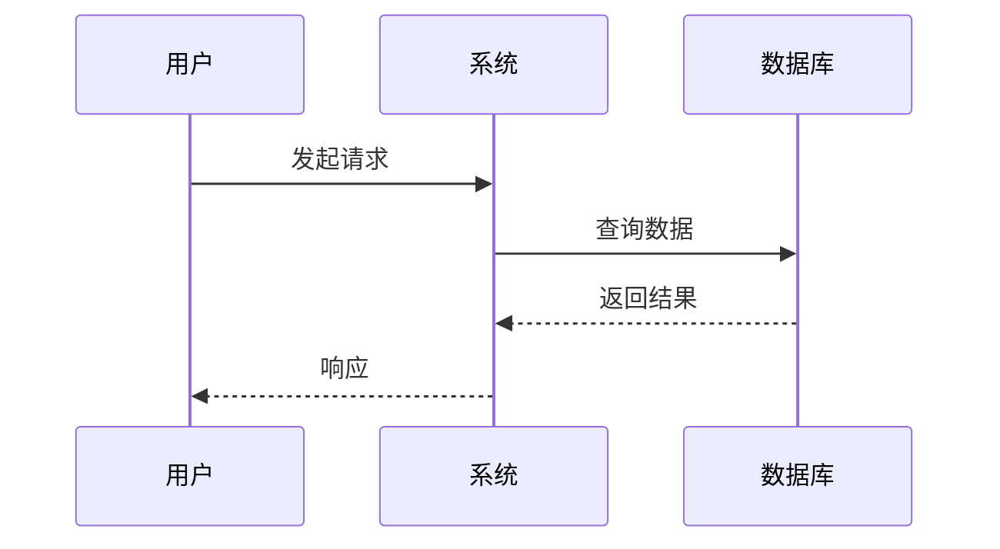
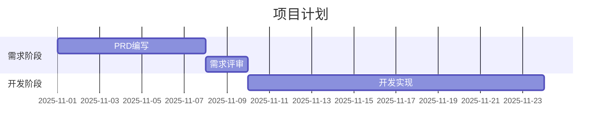

# 项目文档管理体系

一套完整的、标准化的项目文档模板体系，涵盖从需求到上线的全生命周期。

**版本**: v1.0.0 | **创建日期**: 2025-10-31

---

## 📚 目录

- [文档体系概览](#文档体系概览)
- [文档工作流](#文档工作流)
- [模板列表](#模板列表)
- [快速开始](#快速开始)
- [示例项目](#示例项目)
- [最佳实践](#最佳实践)

---

## 🎯 文档体系概览

本体系包含 **12 个标准文档模板**，覆盖产品、设计、技术、测试、运维的全流程：

```
📦 ai-next
├── 📂 templates/          # 文档模板库
│   ├── PRD/              # 产品需求文档
│   ├── UI-design/        # UI/交互设计规范
│   ├── Tech-design/      # 技术设计文档
│   ├── API-doc/          # API 接口文档
│   ├── BDD/              # 行为驱动开发文档
│   ├── Project-plan/     # 项目执行计划
│   ├── Test-plan/        # 测试计划
│   ├── Release-notes/    # 发布说明
│   ├── Runbook/          # 运维手册
│   ├── Change-request/   # 需求变更单
│   ├── Meeting-notes/    # 会议纪要
│   └── Report/           # 周报/月报
└── 📂 projects/          # 实际项目
    └── todolist/         # TodoList 示例项目
```

每个模板包含：
- 📄 `[模板名]-template.md` - 完整的模板文件
- 📋 `CHANGELOG.md` - 版本变更历史
- 📖 `README.md` - 使用说明和最佳实践

---

## 🔄 文档工作流

### 完整的文档循环



---

## 📋 模板列表

### 🔴 核心文档（必需）

#### 1. PRD - 产品需求文档
**用途**: 定义产品功能、用户需求和业务目标
**负责人**: 产品经理
**关注**: What & Why（做什么、为什么做）
**模板位置**: `templates/PRD/`

**包含内容**:
- 项目背景和目标
- 用户分析和场景
- 功能需求详细说明
- 非功能需求
- 成功指标

---

#### 2. UI-design - UI/交互设计规范
**用途**: 定义视觉设计和交互规范
**负责人**: UI/UX 设计师
**关注**: 视觉风格、交互模式、用户体验
**模板位置**: `templates/UI-design/`

**包含内容**:
- 视觉设计规范（品牌色、字体、间距、圆角、阴影）
- 组件库设计（按钮、输入框、卡片等）
- 信息架构（页面结构、导航）
- 交互设计（手势操作、状态反馈、动画）
- 响应式设计（断点规范、适配策略）
- 可访问性规范

---

#### 3. Tech-design - 技术设计文档
**用途**: 详细的技术实现方案和架构设计
**负责人**: 技术负责人/架构师
**关注**: How（如何实现）
**模板位置**: `templates/Tech-design/`

**包含内容**:
- 系统架构和技术栈
- 模块设计
- 数据库设计
- API 设计概览
- 安全和性能设计
- 技术决策记录 (ADR)

---

#### 4. API-doc - API 接口文档
**用途**: 详细的 API 接口规范
**负责人**: 后端开发
**关注**: 接口契约
**模板位置**: `templates/API-doc/`

**包含内容**:
- 接口列表
- 请求/响应格式
- 认证方式
- 错误码定义
- SDK 示例

---

#### 5. BDD - 行为驱动开发文档
**用途**: 将需求转化为可执行的行为规范
**负责人**: 产品/开发/测试共同编写
**关注**: 可验证的行为
**模板位置**: `templates/BDD/`

**包含内容**:
- Given-When-Then 场景
- 验收标准
- 测试数据
- 场景矩阵

---

#### 6. Project-plan - 项目执行计划
**用途**: 项目管理和执行跟踪
**负责人**: 项目经理/Tech Lead
**关注**: How & When（如何做、什么时候做）
**模板位置**: `templates/Project-plan/`

**包含内容**:
- 团队组成
- 任务分解 (WBS)
- 里程碑和时间节点
- 风险和依赖管理
- 资源需求

---

### 🟡 重要文档（推荐）

#### 7. Test-plan - 测试计划
**用途**: 测试策略和用例设计
**负责人**: 测试工程师
**模板位置**: `templates/Test-plan/`

---

#### 8. Release-notes - 发布说明
**用途**: 版本更新内容和升级指南
**负责人**: 产品经理/技术负责人
**模板位置**: `templates/Release-notes/`

---

#### 9. Runbook - 运维手册
**用途**: 部署、监控、故障排查
**负责人**: 运维工程师/SRE
**模板位置**: `templates/Runbook/`

---

### 🟢 辅助文档（可选）

#### 10. Change-request - 需求变更单
**用途**: 规范化需求变更流程
**模板位置**: `templates/Change-request/`

---

#### 11. Meeting-notes - 会议纪要
**用途**: 记录会议决策和行动项
**模板位置**: `templates/Meeting-notes/`

---

#### 12. Report - 周报/月报
**用途**: 定期进度汇报
**模板位置**: `templates/Report/`

---

## 🚀 快速开始

### 1. 开始新项目

```bash
# 1. 在 projects/ 下创建项目文件夹
mkdir -p projects/your-project-name

# 2. 复制需要的模板
cp templates/PRD/PRD-template.md projects/your-project-name/PRD-your-project-v1.0.md
cp templates/Tech-design/Tech-design-template.md projects/your-project-name/Tech-design-your-project-v1.0.md

# 3. 根据实际需求填写模板
```

### 2. 文档命名规范

```
[模板类型]-[项目名]-v[版本号].md

示例：
✅ PRD-todolist-v1.0.md
✅ Tech-design-todolist-v1.0.md
✅ API-doc-user-service-v2.0.md
✅ Release-notes-v1.2.0.md
```

### 3. 推荐工作流

#### 阶段 1: 需求定义（1-2周）
1. 产品经理编写 **PRD**
2. 组织需求评审会议，记录 **Meeting-notes**
3. PRD 批准并锁定

#### 阶段 2: 设计（1-2周）
4. UI/UX 设计师编写 **UI-design**
5. 技术负责人编写 **Tech-design**（参考 UI-design）
6. 后端编写 **API-doc**
7. 测试/开发共同编写 **BDD**
8. 组织技术评审会议

#### 阶段 3: 规划（3-5天）
9. 项目经理创建 **Project-plan**
10. 任务分解和排期
11. 识别风险和依赖
12. 组织项目启动会 (Kick-off)

#### 阶段 4: 执行（4-8周）
13. 开发按 BDD 规范实现功能
14. 每周更新 **Report** 汇报进度
15. 遇到需求变更填写 **Change-request**
16. 定期更新 **Project-plan** 的进度和风险

#### 阶段 5: 测试（1-2周）
17. 测试编写 **Test-plan**
18. 执行测试用例
19. 缺陷修复和回归测试

#### 阶段 6: 发布（1-3天）
20. 编写 **Release-notes**
21. 编写 **Runbook**
22. 灰度发布或全量发布

#### 阶段 7: 运维与复盘
23. 根据 **Runbook** 进行日常运维
24. 在 **Project-plan** 中填写项目复盘
25. 总结经验，进入下一个迭代

---

## 📖 示例项目

### TodoList 待办事项应用

位置: `projects/todolist/`

这是一个完整的项目文档示例，展示了如何正确使用模板：

- ✅ **PRD-todolist-v1.0.md** - 完整的产品需求文档
  - 真实的产品功能定义
  - 详细的用户分析
  - 完整的功能说明和验收标准

**学习建议**:
1. 先阅读 `projects/todolist/README.md` 了解项目概况
2. 深入阅读 `PRD-todolist-v1.0.md` 学习如何编写 PRD
3. 参考这个示例创建自己的项目文档

---

## ✅ 最佳实践

### 1. 文档职责分离

| 文档 | 回答的问题 | 负责人 |
|------|-----------|--------|
| PRD | What & Why | 产品经理 |
| UI-design | 视觉规范 & 交互模式 | UI/UX 设计师 |
| Tech-design | How (技术) | 技术负责人 |
| API-doc | 接口契约 | 后端开发 |
| BDD | 如何验证 | 产品/开发/测试 |
| Project-plan | How & When (执行) | 项目经理 |

### 2. 文档更新原则

**PRD**:
- 需求评审后锁定
- 重大变更需走 Change-request 流程
- 小改动直接更新并记录版本

**Tech-design**:
- 技术评审后锁定
- 实现过程中发现问题可调整，但需记录 ADR

**API-doc**:
- 保持与代码同步
- API 变更必须更新文档

**Project-plan**:
- 持续更新
- 每周同步进度和风险

### 3. 版本管理

所有模板都有版本号：
- **模板版本**: 模板本身的迭代版本
- **文档版本**: 具体项目文档的版本

示例：
```markdown
> **模板版本**: v2.0.0 | **最后更新**: 2025-10-31

## 1. 文档信息
- **文档版本**: v1.0
```

### 4. 团队协作

**评审机制**:
- PRD 评审：产品、设计、技术参与
- 技术方案评审：技术团队评审
- 代码评审：按 Code Review 流程

**文档存储**:
- 推荐使用 Git 管理文档
- 或使用团队协作平台（飞书文档、Notion、Confluence）

### 5. 裁剪原则

根据项目规模灵活使用：

**小项目**（1-2人，1-2周）:
- 必需：PRD（简化版）、API-doc
- 可选：Tech-design（简化版）

**中型项目**（3-5人，1-2月）:
- 必需：PRD、Tech-design、API-doc、Project-plan
- 推荐：BDD、Test-plan

**大型项目**（5+人，2+月）:
- 使用全部模板
- 严格执行评审流程

---

## 🔧 工具推荐

### 文档编辑
- **Markdown 编辑器**: Typora、VS Code、Obsidian
- **协作平台**: 飞书文档、Notion、Confluence

### 项目管理
- **任务跟踪**: Jira、禅道、Teambition
- **甘特图**: Microsoft Project、Omniplan

### 图表绘制
- **架构图**: Draw.io、Excalidraw、PlantUML
- **流程图**: **Mermaid**（推荐，本文档使用）、ProcessOn
- **Mermaid 优势**:
  - 基于文本，易于版本控制
  - 在 Markdown 中直接渲染
  - 支持多种图表类型（流程图、时序图、甘特图等）
  - GitHub、GitLab、VS Code 原生支持

### API 文档
- **规范**: OpenAPI/Swagger
- **工具**: Postman、Apifox

---

## 📊 文档关系图



**说明**:
- **蓝色**: 需求定义（PRD）- 一切的起点
- **橙色**: 设计阶段（UI-design、Tech-design、BDD）- 基于需求的设计
- **绿色**: 项目管理（Project-plan）- 执行规划
- **紫色**: 测试与接口（API-doc、Test-plan）- 实现和验证
- **粉色**: 发布与运维（Release-notes、Runbook）- 交付和维护

---

## 🆘 常见问题

### Q: 所有文档都必须写吗？
A: 不是。根据项目规模灵活裁剪。核心文档（PRD、Tech-design、API-doc）建议都要有。

### Q: 文档太长，有人看吗？
A: 文档是为了沟通和记录，不是为了写而写。简洁清晰比冗长全面更重要。

### Q: 文档过时了怎么办？
A: 把文档当代码一样管理，定期review和更新。过时的文档比没有文档更危险。

### Q: 小团队需要这么正式的文档吗？
A: 可以简化，但建议保留核心文档。即使是2人团队，PRD 和 API-doc 也能大幅提升效率。

### Q: 如何保证文档和代码同步？
A:
1. API-doc 可以通过 OpenAPI 自动生成
2. BDD 可以编写自动化测试
3. 把文档更新纳入 DoD (Definition of Done)

---

## 🤝 贡献

发现模板问题或有改进建议？欢迎：
1. 查看各模板的 CHANGELOG.md 了解变更历史
2. 提出改进建议
3. 根据团队实践调整模板

---

## 📜 许可证

本文档模板体系遵循 MIT 许可证，可自由使用和修改。

---

## 📞 联系方式

如有问题或建议，请联系项目维护者。

---

## 🎨 Mermaid 图表使用指南

本文档使用 Mermaid 绘制流程图和关系图。Mermaid 是一种基于文本的图表工具，可以直接在 Markdown 中渲染。

### 快速开始

在 Markdown 中使用 Mermaid：

````markdown

````

### 常用图表类型

#### 1. 流程图 (Flowchart)


#### 2. 时序图 (Sequence Diagram)


#### 3. 甘特图 (Gantt Chart)


### 在文档中使用

1. **GitHub/GitLab**: 原生支持，直接渲染
2. **VS Code**: 安装 Mermaid 插件即可预览
3. **在线编辑**: https://mermaid.live/

### 参考资源

- Mermaid 官方文档: https://mermaid.js.org/
- 在线编辑器: https://mermaid.live/
- 语法参考: https://mermaid.js.org/intro/

---

**最后更新**: 2025-10-31 | **文档版本**: v1.0.0

**核心理念**:
- 📝 文档是团队沟通的基础
- 🔄 文档驱动开发流程
- ✅ 好的文档能避免80%的返工
- 🎯 适度即可，不要过度设计
- 🎨 使用 Mermaid 让图表可维护
