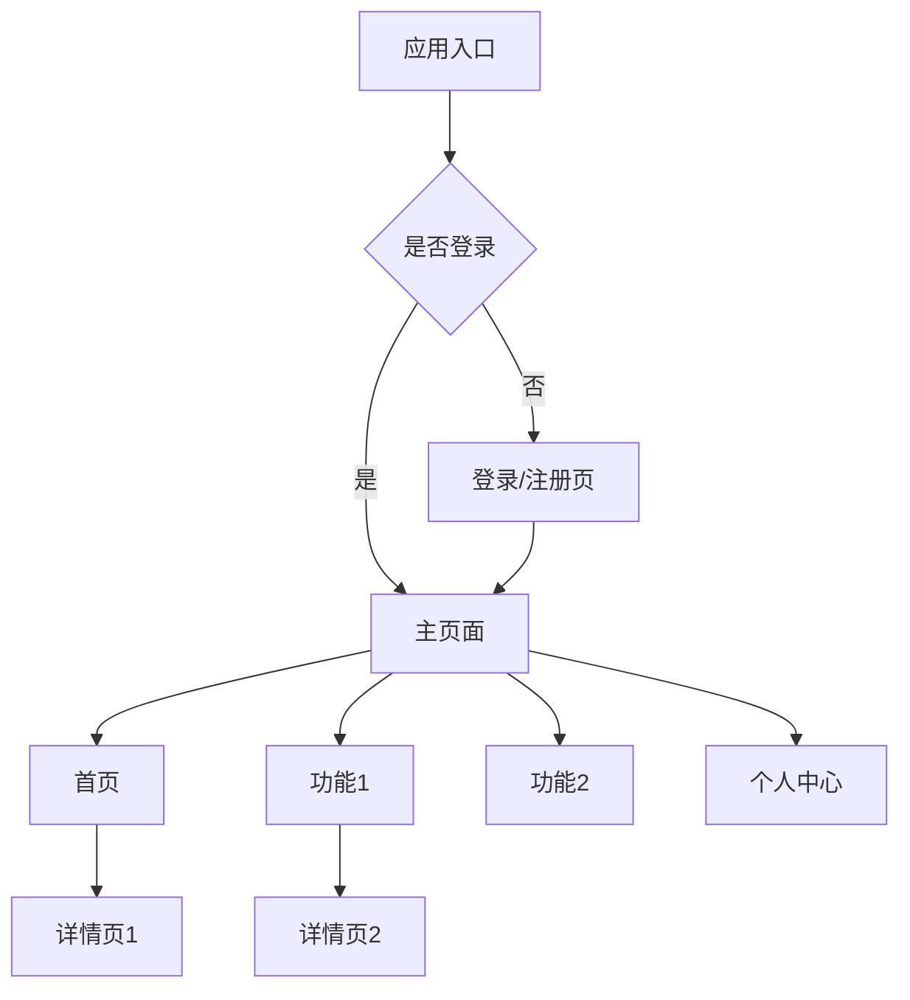

# [项目名称] UI/交互设计规范

> **模板版本**: v1.0.0 | **最后更新**: 2025-10-31

---

## 1. 文档信息

| 项目 | 内容 |
|------|------|
| **项目名称** | [项目名称] |
| **文档版本** | v1.0 |
| **创建日期** | YYYY-MM-DD |
| **最后更新** | YYYY-MM-DD |
| **负责人** | [UI/UX 设计师] |
| **评审状态** | 待评审 / 已批准 |
| **关联文档** | [PRD-项目名.md] |

### 文档修订记录

| 版本 | 日期 | 修订人 | 修订内容 |
|------|------|--------|----------|
| v0.1 | YYYY-MM-DD | [姓名] | 初稿 |
| v1.0 | YYYY-MM-DD | [姓名] | 正式版 |

---

## 2. 设计概述

### 2.1 设计目标

**核心目标**:
- 目标1: 如"提供简洁直观的用户体验"
- 目标2: 如"建立统一的视觉语言"
- 目标3: 如"提升任务完成效率"

### 2.2 设计原则

1. **[原则1 - 如"简洁至上"]**
   - 去除不必要的视觉元素
   - 突出核心功能
   - 减少用户认知负担

2. **[原则2 - 如"一致性"]**
   - 保持视觉风格统一
   - 交互模式可预测
   - 组件使用规范化

3. **[原则3 - 如"易用性"]**
   - 符合用户使用习惯
   - 操作反馈及时
   - 容错性设计

### 2.3 目标用户

| 用户类型 | 特征 | 设计考量 |
|---------|------|----------|
| 主要用户 | [年龄、职业、技术水平] | [针对性设计策略] |
| 次要用户 | [年龄、职业、技术水平] | [针对性设计策略] |

---

## 3. 视觉设计规范

### 3.1 品牌色

**主色**:
- Primary: `#1976D2` (蓝色)
  - 用途: 主要按钮、链接、重点信息
  - RGB: (25, 118, 210)

**辅助色**:
- Secondary: `#FF4081` (粉色)
  - 用途: 强调、提示、次要操作

- Success: `#4CAF50` (绿色)
- Warning: `#FF9800` (橙色)
- Error: `#F44336` (红色)
- Info: `#2196F3` (浅蓝)

**中性色**:
- 文字黑: `#212121`
- 文字灰: `#757575`
- 分割线: `#E0E0E0`
- 背景灰: `#FAFAFA`
- 纯白: `#FFFFFF`

```
色板示例：
[#1976D2] [#FF4081] [#4CAF50] [#FF9800] [#F44336]
```

### 3.2 字体规范

**移动端 (iOS/Android)**:
- iOS: San Francisco
- Android: Roboto
- 中文: PingFang SC / Noto Sans CJK

**Web 端**:
```css
font-family: -apple-system, BlinkMacSystemFont, 'Segoe UI',
             'PingFang SC', 'Hiragino Sans GB', 'Microsoft YaHei',
             sans-serif;
```

**字号体系**:
| 用途 | 字号 | 行高 | 字重 |
|------|------|------|------|
| 标题1 | 32px | 40px | Bold (700) |
| 标题2 | 24px | 32px | SemiBold (600) |
| 标题3 | 20px | 28px | SemiBold (600) |
| 正文大 | 16px | 24px | Regular (400) |
| 正文 | 14px | 22px | Regular (400) |
| 正文小 | 12px | 18px | Regular (400) |
| 辅助文字 | 11px | 16px | Regular (400) |

### 3.3 间距规范

**基础单位**: 8px (0.5rem)

**间距体系**:
- xs: 4px (0.5 × 基础单位)
- sm: 8px (1 × 基础单位)
- md: 16px (2 × 基础单位)
- lg: 24px (3 × 基础单位)
- xl: 32px (4 × 基础单位)
- xxl: 48px (6 × 基础单位)

**使用场景**:
- 元素内边距: 通常使用 md (16px)
- 卡片间距: lg (24px)
- 模块间距: xl (32px)
- 页面边距: md - lg (16-24px)

### 3.4 圆角规范

| 类型 | 圆角值 | 使用场景 |
|------|--------|----------|
| 小圆角 | 4px | 按钮、标签、输入框 |
| 中圆角 | 8px | 卡片、对话框 |
| 大圆角 | 12px | 大卡片、底部弹窗 |
| 圆形 | 50% | 头像、图标按钮 |

### 3.5 阴影规范

**卡片阴影**:
```css
/* 轻阴影 */
box-shadow: 0 2px 4px rgba(0, 0, 0, 0.1);

/* 中阴影 */
box-shadow: 0 4px 8px rgba(0, 0, 0, 0.12);

/* 重阴影 */
box-shadow: 0 8px 16px rgba(0, 0, 0, 0.15);
```

---

## 4. 信息架构

### 4.1 页面结构



### 4.2 导航结构

**移动端 - Tab 导航**:
```
┌─────────────────────────────┐
│                             │
│        页面内容区域          │
│                             │
└─────────────────────────────┘
┌──────┬──────┬──────┬──────┐
│ 首页 │ 功能 │ 消息 │ 我的  │
└──────┴──────┴──────┴──────┘
```

**Web 端 - 侧边栏导航**:
```
┌─────┬───────────────────────┐
│     │                       │
│ 导  │     页面内容区域       │
│ 航  │                       │
│ 栏  │                       │
│     │                       │
└─────┴───────────────────────┘
```

---

## 5. 组件设计规范

### 5.1 按钮 (Button)

**主要按钮 (Primary)**:
- 背景色: Primary Color (#1976D2)
- 文字色: White
- 高度: 40px (移动端), 36px (Web)
- 圆角: 4px
- 最小宽度: 80px

**次要按钮 (Secondary)**:
- 边框: 1px solid Primary Color
- 背景: 透明
- 文字色: Primary Color

**禁用状态**:
- 背景色: #E0E0E0
- 文字色: #9E9E9E
- 不可点击

**尺寸规范**:
| 尺寸 | 高度 | 内边距 | 字号 |
|------|------|--------|------|
| Large | 48px | 24px | 16px |
| Medium | 40px | 16px | 14px |
| Small | 32px | 12px | 12px |

### 5.2 输入框 (Input)

**默认状态**:
```
┌──────────────────────────────┐
│ 请输入...                     │
└──────────────────────────────┘
```

**规范**:
- 高度: 40px
- 内边距: 12px
- 边框: 1px solid #E0E0E0
- 圆角: 4px
- 字号: 14px

**聚焦状态**:
- 边框: 2px solid Primary Color
- 添加阴影: 0 0 0 2px rgba(25, 118, 210, 0.1)

**错误状态**:
- 边框: 1px solid Error Color
- 下方显示错误提示文字

### 5.3 卡片 (Card)

```
┌──────────────────────────────┐
│ 标题                          │
├──────────────────────────────┤
│                              │
│ 内容区域                      │
│                              │
└──────────────────────────────┘
```

**规范**:
- 背景: White
- 圆角: 8px
- 阴影: 0 2px 4px rgba(0, 0, 0, 0.1)
- 内边距: 16px
- 间距: 16px (卡片之间)

### 5.4 列表 (List)

**列表项**:
```
┌──────────────────────────────┐
│ 🔵 标题                       │
│    描述信息                   │
└──────────────────────────────┘
```

**规范**:
- 高度: 自适应，最小 56px
- 内边距: 16px
- 分割线: 1px solid #E0E0E0
- 点击态: 背景色 #F5F5F5

### 5.5 对话框 (Dialog/Modal)

**居中对话框**:
```
      ┌──────────────────┐
      │ 标题             │
      ├──────────────────┤
      │ 内容区域         │
      │                  │
      ├──────────────────┤
      │ [取消]   [确定]  │
      └──────────────────┘
```

**规范**:
- 宽度: 最大 400px (移动端 90%)
- 圆角: 8px
- 遮罩: rgba(0, 0, 0, 0.5)
- 动画: 淡入淡出

---

## 6. 页面设计

### 6.1 页面1 - [页面名称]

**设计目标**:
- [该页面要解决的问题]
- [用户预期达成的目标]

**线框图**:
```
┌─────────────────────────────┐
│ 📱 页面标题             ⚙️ │
├─────────────────────────────┤
│                             │
│   [主要内容区域示意图]      │
│                             │
│                             │
├─────────────────────────────┤
│ [底部操作栏]                │
└─────────────────────────────┘
```

**设计说明**:
1. [元素1]: [说明其作用和交互方式]
2. [元素2]: [说明其作用和交互方式]

**Figma 链接**: [设计稿链接]

---

## 7. 交互设计

### 7.1 手势操作（移动端）

| 手势 | 操作 | 响应 |
|------|------|------|
| 点击 (Tap) | 选中项目 | 进入详情 |
| 长按 (Long Press) | 列表项 | 显示操作菜单 |
| 滑动 (Swipe) | 左滑 | 显示删除按钮 |
| 下拉 (Pull Down) | 页面顶部 | 刷新数据 |
| 上拉 (Pull Up) | 页面底部 | 加载更多 |

### 7.2 状态反馈

**加载状态**:
- Loading 动画: 旋转的圆形指示器
- 骨架屏: 用于列表和卡片

**空状态**:
```
        🔍
    暂无数据
  [操作按钮]
```

**错误状态**:
```
        ⚠️
   加载失败
  [重试按钮]
```

### 7.3 动画设计

**基础动画**:
- 页面切换: 滑动动画 (300ms)
- 弹窗出现: 淡入 + 缩放 (200ms)
- 按钮点击: 波纹效果
- 列表加载: 淡入 (150ms)

**缓动函数**:
- 标准: cubic-bezier(0.4, 0.0, 0.2, 1)
- 进入: cubic-bezier(0.0, 0.0, 0.2, 1)
- 退出: cubic-bezier(0.4, 0.0, 1, 1)

---

## 8. 响应式设计

### 8.1 断点规范

| 断点 | 设备 | 宽度范围 |
|------|------|----------|
| xs | 手机竖屏 | < 600px |
| sm | 手机横屏/小平板 | 600px - 960px |
| md | 平板 | 960px - 1280px |
| lg | 桌面 | 1280px - 1920px |
| xl | 大屏 | > 1920px |

### 8.2 适配策略

**移动端优先**:
- 先设计移动端界面
- 逐步增强到平板和桌面

**布局调整**:
- 移动端: 单列布局
- 平板: 1-2列布局
- 桌面: 2-3列布局

---

## 9. 可访问性 (Accessibility)

### 9.1 对比度

- 正文文字: 至少 4.5:1
- 大文字 (18px+): 至少 3:1
- UI 组件: 至少 3:1

### 9.2 触摸目标

- 最小尺寸: 44 × 44 点 (iOS), 48 × 48dp (Android)
- 间距: 至少 8px

### 9.3 无障碍支持

- 提供合适的 ARIA 标签
- 支持键盘导航
- 提供屏幕阅读器支持
- 支持文字缩放

---

## 10. 设计交付物

### 10.1 交付清单

- [ ] Figma 设计稿（包含所有页面）
- [ ] 切图资源（@1x, @2x, @3x）
- [ ] 图标库（SVG 格式）
- [ ] 设计规范文档（本文档）
- [ ] 组件库 Sketch/Figma 文件
- [ ] 动效说明视频（如有）

### 10.2 设计稿链接

**Figma 项目**:
- 链接: [https://figma.com/file/...]
- 查看权限: 所有团队成员

**设计资源**:
- 图标库: [链接]
- 插画素材: [链接]
- 品牌资源: [链接]

---

## 11. 设计规范维护

### 11.1 更新原则

- 保持设计系统的一致性
- 重大变更需团队评审
- 及时同步到开发团队

### 11.2 反馈机制

- 设计评审会议: 每周
- 问题反馈: [Slack #design 频道]
- 改进建议: [收集表单链接]

---

## 12. 参考资源

**设计系统参考**:
- Material Design: https://material.io/design
- Apple HIG: https://developer.apple.com/design/human-interface-guidelines/
- Ant Design: https://ant.design/

**工具**:
- Figma: 设计工具
- Zeplin: 设计交付
- Principle: 动效设计

---

**设计负责人**: [姓名]
**评审人员**: [产品、前端、测试]
**批准日期**: YYYY-MM-DD

---

**注意事项**:
- 本文档为设计规范，开发时需严格遵守
- 如有疑问请及时与设计团队沟通
- 设计规范会根据项目进展持续更新
